# ねじ締結

## 1. 目的

機械をはじめ、様々な機器の組み立てに使用されるねじ締結について、その基本原理を理解する。本レポートでは実験1（トルク法によるねじ締結）、実験2（ナット回転角法によるねじ締結）、実験3（トルク勾配法によるねじ締結）の結果を報告する。

## 2. 使用機器

- ひずみゲージ
- ひずみ測定器
- トルクレンチ（ソケットレンチ取付、回転角度目盛付き）
- 試料ボルト・ナット（強度区分4.8、8.8×2本、10.9、12.9）、座金、被締結物

## 3. 実験原理

### 3.1 ねじの軸力とトルクの関係

ねじの締付トルク$T_f$は、ねじ部に作用するトルク$T_s$と座面に作用するトルク$T_w$の和である。

$$
T_f = T_s + T_w
$$

ねじは斜面を円筒に巻き付けたものと見なすことができ、斜面の原理より、ねじ部に作用するトルク$T_s$は次式で表される。

$$
T_s = \frac{F}{2}\left(\frac{\mu_s}{\cos\alpha'}d_2 + \frac{P}{\pi}\right)
$$

ここで$d_2$はねじの有効径、$F$は軸力、$\mu_s$はねじ部の摩擦係数、$P$はねじのピッチ、$\alpha$はねじ山の半角（メートルねじでは$\alpha=30^\circ$）である。多くの締結ねじではリード角$\beta$が小さいため$\alpha'\fallingdotseq\alpha$としてよい。第1項がねじ面の摩擦によるトルク、第2項が軸力を増加させるためのトルクである。

座面に作用するトルク$T_w$は次式で表される。

$$
T_w = \frac{d_v}{2}F\mu_w
$$

ここで$d_v$は座面の摩擦トルクの等価直径、$\mu_w$は座面の摩擦係数である。

### 3.2 ひずみ測定による軸力・トルクの算出

被締結物に貼付したひずみゲージにより、圧縮ひずみ$\varepsilon_1$（CH1）とねじれひずみ$\varepsilon_2$（CH2）を測定する。圧縮ひずみは2枚のひずみゲージの合計を測定するため実際のひずみは測定値の1/2、ねじれひずみは4枚の合計を測定するため実際のひずみは測定値の1/4になる。

ボルト軸力$F$は、被締結物の断面積$A_c$と縦弾性係数$E_c$を用いて次式で算出する。

$$
F = E_c\,\varepsilon_1\,A_c
$$

座面の摩擦トルク$T_w$は、ねじれひずみとねじれトルクの関係式より、被締結物の極断面係数$Z_p$とポアソン比$\nu$を用いて次式で算出する。

$$
T_w = \frac{\varepsilon_2\,E_c\,Z_p}{1+\nu}
$$

ねじ部のトルク$T_s$は、3.1節の関係より$T_s=T_f-T_w$で求まる。

### 3.3 摩擦係数の算出

座面の摩擦係数$\mu_w$とねじ部の摩擦係数$\mu_s$は、3.1節の式を変形して次式で算出する。

$$
\mu_w = \frac{2T_w}{d_v F},\qquad
\mu_s = \cos\alpha\left(\frac{2T_s}{d_2 F} - \frac{P}{\pi d_2}\right)
$$

### 3.4 試料の諸元

試料ボルト・被締結物の測定値および計算により求めた定数を表3.1、表3.2に示す。

**表3.1　ボルトの諸元**

| 項目 | 記号 | 値 |
| :--- | :---: | ---: |
| 呼び径 [mm] | $d$ | 7.90 |
| ピッチ [mm] | $P$ | 1.25 |
| 円筒部長さ [mm] | $l_g$ | 26.80 |
| 遊びねじ部長さ [mm] | $l_s$ | 13.20 |
| ねじ部有効径 [mm] | $d_2$ | 7.188 |
| ねじ山半角 [°] | $\alpha$ | 30 |
| 円筒部断面積 [m²] | $A_g$ | 4.90×10⁻⁵ |
| ねじ部有効断面積 [m²] | $A_s$ | 4.06×10⁻⁵ |
| 縦弾性係数 [GPa] | $E_b$ | 206 |
| 引張ばね定数 [N/m] | $K_B$ | 1.864×10⁸ |
| ナット回転角1°当たりの締め込み量 [m] | − | 3.47×10⁻⁶ |

**表3.2　被締結物の諸元および締結体全体の定数**

| 項目 | 記号 | 値 |
| :--- | :---: | ---: |
| 外径 [mm] | $d_c$ | 15.6 |
| 内径 [mm] | $d_h$ | 8.4 |
| 長さ [mm] | $l_c$ | 40 |
| 縦弾性係数 [GPa] | $E_c$ | 206 |
| ポアソン比 | $\nu$ | 0.3 |
| 断面積 [m²] | $A_c$ | 1.357×10⁻⁴ |
| 極断面係数 [m³] | $Z_p$ | 6.83×10⁻⁷ |
| 圧縮ばね定数 [N/m] | $K_c$ | 6.99×10⁸ |
| 座面の摩擦トルクの等価直径 [mm] | $d_v$ | 10.86 |
| へたり係数 [N/m] | $Z$ | 1.47×10⁸ |
| 内外力比 | $\phi$ | 0.211 |

## 4. 実験手順

### 4.1 実験1　トルク法によるねじ締結

1. 被締結物に頭部を下にしてボルトを通し、上部に座金を通し、ナットを指で締め込む。
2. トルクレンチにソケットレンチを取り付け、ナットにかける。
3. トルクレンチの目盛りを見て、締付トルクを5Nmずつ増加させ、被締結物の圧縮ひずみ・ねじれひずみを読み取る（読取終了までトルクを保持する）。
4. 締付トルクが目標値に達したら実験終了。目標値は強度区分4.8で15Nm、8.8で25Nm、10.9で35Nm、12.9で40Nmである。

1〜4を繰り返し、強度区分4.8を1本、8.8を2本（ナット2種類）、10.9を1本、12.9を1本、計5本について実験を行った。

### 4.2 実験2　ナット回転角法によるねじ締結

1. 被締結物に頭部を下にしてボルトを通し、上部に座金を通し、ナットを指で締め込む。
2. トルクレンチを用いて締付トルクが10Nmに達するまで締め込み（スナグトルク）、回転角度目盛を0°に合わせる。
3. 回転角度目盛を見ながらナット回転角$\theta$を10°ずつ増加させ、そのつど被締結物の圧縮ひずみ・ねじれひずみを読み取る。
4. 回転角度が目標値（150°）に達したら実験終了とする（締め込み量は$5P/12\fallingdotseq0.521$mm）。

1〜4を繰り返し、強度区分4.8を1本、8.8を2本（ナット2種類）、10.9を1本、12.9を1本、計5本について実験を行った。

### 4.3 実験3　トルク勾配法によるねじ締結

1. 被締結物に頭部を下にしてボルトを通し、上部に座金を通し、ナットを指で締め込む。
2. トルクレンチを用いて締付トルクが10Nmに達するまで締め込み（スナグトルク）、回転角度目盛を0°に合わせる。
3. 回転角度目盛を見ながらナット回転角$\theta$を10°ずつ増加させ、そのつど被締結物の圧縮ひずみ・ねじれひずみ・締付トルクを読み取る。
4. 回転角10°ごとの締付トルクの変化量（トルク勾配$\Delta T_f/\Delta\theta$）が、弾性域における勾配（スナグトルクから最初の10°までの変化量）の1/2以下に低下したら実験終了とする。

1〜4を繰り返し、強度区分4.8を1本、8.8を2本（ナット2種類）、10.9を1本、12.9を1本、計5本について実験を行った。

## 5. 実験結果

### 5.1 実験1　トルク法によるねじ締結

各ボルトの測定値（CH1・CH2）と、3.2〜3.3節の式で算出したボルト軸力$F$、座面の摩擦トルク$T_w$、ねじ部のトルク$T_s$、座面の摩擦係数$\mu_w$、ねじ部の摩擦係数$\mu_s$を表5.1〜5.5に示す。

**表5.1　1本目（強度区分4.8、亜鉛電気メッキ）**

| $T_f$ [Nm] | CH1 | CH2 | $F$ [N] | $T_w$ [Nm] | $T_s$ [Nm] | $\mu_w$ | $\mu_s$ |
| ---: | ---: | ---: | ---: | ---: | ---: | ---: | ---: |
| 5 | 179 | 78 | 2501.9 | 2.110 | 2.890 | 0.155 | 0.230 |
| 10 | 310 | 120 | 4332.9 | 3.247 | 6.753 | 0.138 | 0.328 |
| 15 | 470 | 163 | 6569.2 | 4.410 | 10.590 | 0.124 | 0.340 |

**表5.2　2本目（強度区分8.8、亜鉛電気メッキ）**

| $T_f$ [Nm] | CH1 | CH2 | $F$ [N] | $T_w$ [Nm] | $T_s$ [Nm] | $\mu_w$ | $\mu_s$ |
| ---: | ---: | ---: | ---: | ---: | ---: | ---: | ---: |
| 5 | 116 | 40 | 1621.3 | 1.082 | 3.918 | 0.123 | 0.534 |
| 10 | 237 | 89 | 3312.6 | 2.408 | 7.592 | 0.134 | 0.504 |
| 15 | 370 | 138 | 5171.5 | 3.734 | 11.266 | 0.133 | 0.477 |
| 20 | 495 | 177 | 6918.7 | 4.789 | 15.211 | 0.127 | 0.482 |
| 25 | 650 | 210 | 9085.1 | 5.682 | 19.318 | 0.115 | 0.464 |

**表5.3　3本目（強度区分8.8、溶融亜鉛メッキ）**

| $T_f$ [Nm] | CH1 | CH2 | $F$ [N] | $T_w$ [Nm] | $T_s$ [Nm] | $\mu_w$ | $\mu_s$ |
| ---: | ---: | ---: | ---: | ---: | ---: | ---: | ---: |
| 5 | 150 | 44 | 2096.6 | 1.191 | 3.809 | 0.105 | 0.390 |
| 10 | 278 | 101 | 3885.6 | 2.733 | 7.267 | 0.129 | 0.403 |
| 15 | 420 | 200 | 5870.4 | 5.411 | 9.589 | 0.170 | 0.346 |
| 20 | 555 | 280 | 7757.3 | 7.576 | 12.424 | 0.180 | 0.338 |
| 25 | 680 | 340 | 9504.4 | 9.199 | 15.801 | 0.178 | 0.353 |

**表5.4　4本目（強度区分10.9、四三酸化鉄メッキ）**

| $T_f$ [Nm] | CH1 | CH2 | $F$ [N] | $T_w$ [Nm] | $T_s$ [Nm] | $\mu_w$ | $\mu_s$ |
| ---: | ---: | ---: | ---: | ---: | ---: | ---: | ---: |
| 5 | 265 | 98 | 3703.9 | 2.652 | 2.348 | 0.132 | 0.105 |
| 10 | 543 | 169 | 7589.6 | 4.573 | 5.427 | 0.111 | 0.124 |
| 15 | 807 | 225 | 11279.5 | 6.088 | 8.912 | 0.099 | 0.142 |
| 20 | 1053 | 278 | 14717.9 | 7.522 | 12.478 | 0.094 | 0.156 |
| 25 | 1338 | 298 | 18701.4 | 8.063 | 16.937 | 0.079 | 0.170 |
| 30 | 1513 | 342 | 21147.4 | 9.254 | 20.746 | 0.081 | 0.188 |
| 35 | 1742 | 363 | 24348.1 | 9.822 | 25.178 | 0.074 | 0.201 |

**表5.5　5本目（強度区分12.9、四三酸化鉄メッキ）**

| $T_f$ [Nm] | CH1 | CH2 | $F$ [N] | $T_w$ [Nm] | $T_s$ [Nm] | $\mu_w$ | $\mu_s$ |
| ---: | ---: | ---: | ---: | ---: | ---: | ---: | ---: |
| 5 | 267 | 87 | 3731.9 | 2.354 | 2.646 | 0.116 | 0.123 |
| 10 | 453 | 161 | 6331.6 | 4.356 | 5.644 | 0.127 | 0.167 |
| 15 | 652 | 235 | 9113.1 | 6.358 | 8.642 | 0.128 | 0.181 |
| 20 | 887 | 285 | 12397.7 | 7.711 | 12.289 | 0.114 | 0.191 |
| 25 | 1171 | 300 | 16367.2 | 8.117 | 16.883 | 0.091 | 0.201 |
| 30 | 1475 | 345 | 20616.2 | 9.335 | 20.665 | 0.083 | 0.194 |
| 35 | 1667 | 358 | 23299.8 | 9.687 | 25.313 | 0.077 | 0.214 |
| 40 | 1760 | 360 | 24599.7 | 9.741 | 30.259 | 0.073 | 0.248 |

締付トルク$T_f$とボルト軸力$F$の関係を図1に示す。なお1本目（強度区分4.8）は締付トルク上限が15Nmであるため20Nm・25Nmは未測定であるが、グラフ上では白四角の点が$F=0$の位置に残っている。この2点は測定値ではなく、表5.1にも記載がないため考察の対象としない。

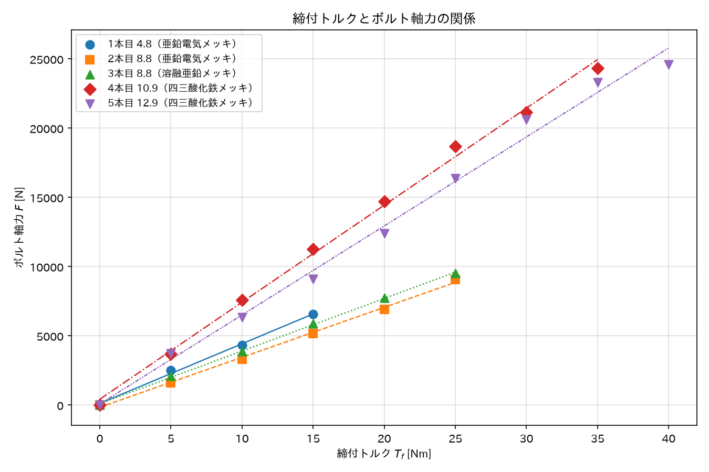

**図1　締付トルクとボルト軸力の関係**

締付トルク$T_f$と座面の摩擦トルク$T_w$の関係を図2に示す。図1と同様、1本目の20Nm・25Nmの点（$T_w=0$）は未測定のため考察の対象としない。

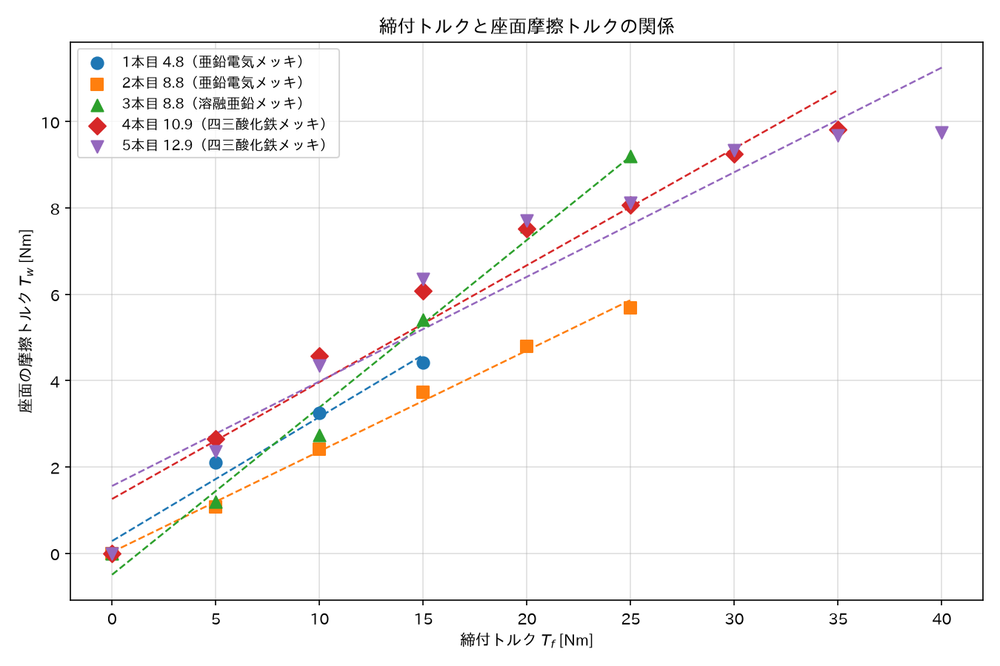

**図2　締付トルクと座面摩擦トルクの関係**

締付トルク$T_f$とねじ部のトルク$T_s$の関係を図3に示す。1本目の20Nm・25Nmは未測定のためプロットされていない。

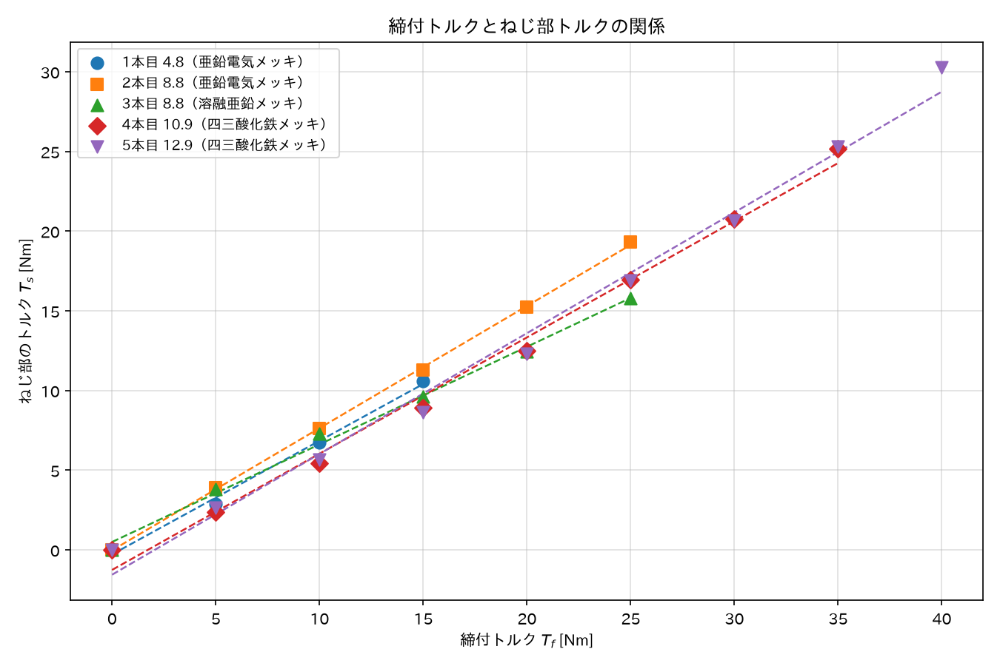

**図3　締付トルクとねじ部トルクの関係**

締付トルク$T_f$と座面の摩擦係数$\mu_w$の関係を図4に示す。摩擦係数は締付トルクに対して理論上の直線関係を持たないため、データ点のみを示す。1本目の20Nm・25Nmの点（$\mu_w=0$）は表5.1のとおり$T_w=0$の未測定点であり、考察の対象としない。

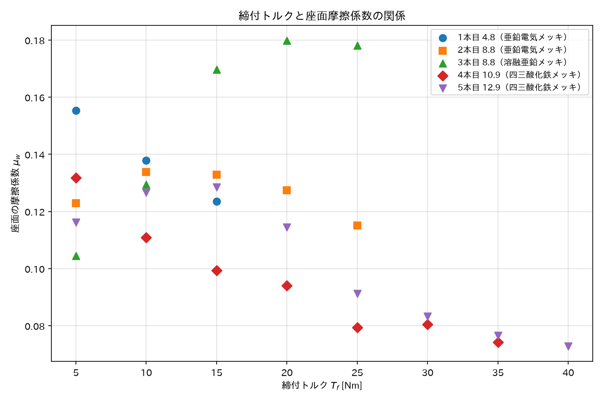

**図4　締付トルクと座面摩擦係数の関係**

締付トルク$T_f$とねじ部の摩擦係数$\mu_s$の関係を図5に示す。1本目の20Nm・25Nmの点（$\mu_s=0$）についても図4と同様、未測定点であり考察の対象としない。

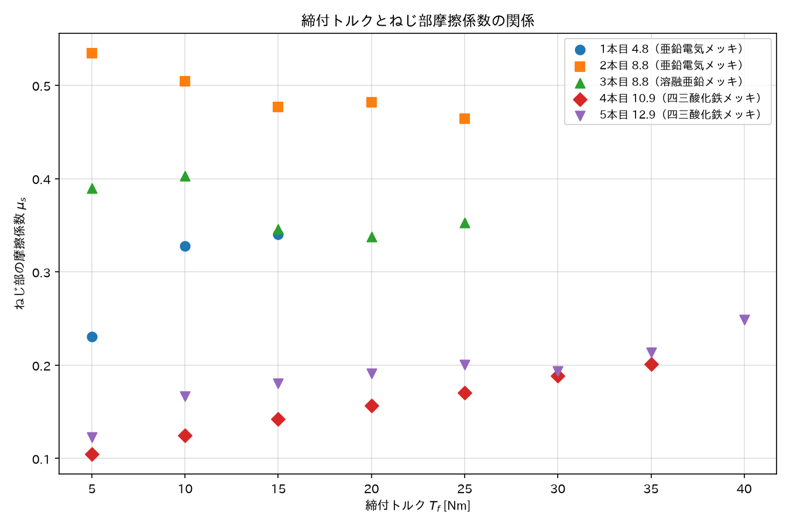

**図5　締付トルクとねじ部摩擦係数の関係**

### 5.2 実験2　ナット回転角法によるねじ締結

各ボルトについて、ナット回転角$\theta$（0〜150°、10°刻み）ごとのCH1・CH2測定値と、3.2節の式で算出したボルト軸力$F$、被締結物とボルト軸の残留トルク$T_r$（実験1の$T_w$と同じ式で算出。指導書の呼称にならいTrと表記）、へたり係数の実験値$Z$を表5.6〜5.10に示す。$Z$は直前の測定点との軸力の変化量$\Delta F$を、そのときのナットの締め込み量の変化量$\Delta l$（回転角10°当たり$3.47\times10^{-5}$m、表3.1参照）で除した値$Z=\Delta F/\Delta l$であり、指導書の実験結果のまとめ③に対応する（スナグトルクの点は計算対象に含めない）。

**表5.6　1本目（強度区分4.8、亜鉛電気メッキ）**

| $\theta$ [°] | CH1 | CH2 | $F$ [N] | $T_r$ [Nm] | $Z$ [×10⁷N/m] |
| ---: | ---: | ---: | ---: | ---: | ---: |
| 0 | -252 | -95 | 3522.7 | 2.570 | − |
| 10 | -452 | -20 | 6318.4 | 0.541 | 8.05 |
| 20 | -574 | -45 | 8023.8 | 1.217 | 4.91 |
| 30 | -686 | -88 | 9589.5 | 2.380 | 4.51 |
| 40 | -705 | -110 | 9855.1 | 2.975 | 0.76 |
| 50 | -666 | -130 | 9309.9 | 3.516 | -1.57 |
| 60 | -640 | -120 | 8946.5 | 3.246 | -1.05 |
| 70 | -604 | -113 | 8443.2 | 3.056 | -1.45 |
| 80 | -586 | -67 | 8191.6 | 1.812 | -0.72 |
| 90 | -553 | -136 | 7730.3 | 3.679 | -1.33 |
| 100 | -554 | -183 | 7744.3 | 4.950 | 0.04 |
| 110 | -532 | -178 | 7436.7 | 4.815 | -0.89 |
| 120 | -501 | -189 | 7003.4 | 5.112 | -1.25 |
| 130 | -496 | -177 | 6933.5 | 4.787 | -0.20 |
| 140 | -493 | -78 | 6891.6 | 2.110 | -0.12 |
| 150 | -478 | -177 | 6681.9 | 4.787 | -0.60 |

**表5.7　2本目（強度区分8.8、亜鉛電気メッキ）**

| $\theta$ [°] | CH1 | CH2 | $F$ [N] | $T_r$ [Nm] | $Z$ [×10⁷N/m] |
| ---: | ---: | ---: | ---: | ---: | ---: |
| 0 | -170 | -22 | 2376.4 | 0.595 | − |
| 10 | -299 | -74 | 4179.7 | 2.002 | 5.19 |
| 20 | -395 | -110 | 5521.6 | 2.975 | 3.86 |
| 30 | -485 | -125 | 6779.7 | 3.381 | 3.62 |
| 40 | -582 | -88 | 8135.7 | 2.380 | 3.91 |
| 50 | -699 | -32 | 9771.2 | 0.866 | 4.71 |
| 60 | -842 | -177 | 11770.2 | 4.787 | 5.76 |
| 70 | -947 | -84 | 13238.0 | 2.272 | 4.23 |
| 80 | -1002 | -120 | 14006.8 | 3.246 | 2.21 |
| 90 | -1006 | -45 | 14062.7 | 1.217 | 0.16 |
| 100 | -1042 | -3 | 14565.9 | 0.081 | 1.45 |
| 110 | -996 | -254 | 13922.9 | 6.870 | -1.85 |
| 120 | -980 | -3 | 13699.3 | 0.081 | -0.64 |
| 130 | -1000 | -214 | 13978.8 | 5.788 | 0.81 |
| 140 | -951 | -193 | 13293.9 | 5.220 | -1.97 |
| 150 | -965 | -55 | 13489.6 | 1.488 | 0.56 |

**表5.8　3本目（強度区分8.8、溶融亜鉛メッキ）**

| $\theta$ [°] | CH1 | CH2 | $F$ [N] | $T_r$ [Nm] | $Z$ [×10⁷N/m] |
| ---: | ---: | ---: | ---: | ---: | ---: |
| 0 | -367 | -118 | 5130.2 | 3.192 | − |
| 10 | -501 | -168 | 7003.4 | 4.544 | 5.39 |
| 20 | -677 | -207 | 9463.7 | 5.599 | 7.09 |
| 30 | -862 | -242 | 12049.8 | 6.546 | 7.45 |
| 40 | -1037 | -257 | 14496.0 | 6.951 | 7.05 |
| 50 | -1177 | -260 | 16453.1 | 7.032 | 5.64 |
| 60 | -1290 | -241 | 18032.7 | 6.519 | 4.55 |
| 70 | -1361 | -234 | 19025.2 | 6.329 | 2.86 |
| 80 | -1419 | -238 | 19836.0 | 6.437 | 2.34 |
| 90 | -1455 | -258 | 20339.2 | 6.978 | 1.45 |
| 100 | -1446 | -143 | 20213.4 | 3.868 | -0.36 |
| 110 | -1402 | -168 | 19598.3 | 4.544 | -1.77 |
| 120 | -1369 | -169 | 19137.0 | 4.571 | -1.33 |
| 130 | -1367 | -204 | 19109.1 | 5.518 | -0.08 |
| 140 | -1367 | -94 | 19109.1 | 2.542 | 0.00 |
| 150 | -1284 | -97 | 17948.8 | 2.624 | -3.34 |

**表5.9　4本目（強度区分10.9、四三酸化鉄メッキ）**

| $\theta$ [°] | CH1 | CH2 | $F$ [N] | $T_r$ [Nm] | $Z$ [×10⁷N/m] |
| ---: | ---: | ---: | ---: | ---: | ---: |
| 0 | -392 | -143 | 5479.7 | 3.868 | − |
| 10 | -1012 | 59 | 14146.6 | 1.596 | 24.96 |
| 20 | -1269 | -160 | 17739.1 | 4.328 | 10.35 |
| 30 | -1443 | 126 | 20171.5 | 3.408 | 7.01 |
| 40 | -1537 | -220 | 21485.5 | 5.951 | 3.78 |
| 50 | -1636 | -111 | 22869.4 | 3.002 | 3.99 |
| 60 | -1710 | -104 | 23903.8 | 2.813 | 2.98 |
| 70 | -1758 | -129 | 24574.8 | 3.489 | 1.93 |
| 80 | -1773 | -314 | 24784.5 | 8.493 | 0.60 |
| 90 | -1801 | -28 | 25175.9 | 0.757 | 1.13 |
| 100 | -1794 | -170 | 25078.0 | 4.598 | -0.28 |
| 110 | -1787 | -258 | 24980.2 | 6.978 | -0.28 |
| 120 | -1798 | -26 | 25133.9 | 0.703 | 0.44 |
| 130 | -1813 | 51 | 25343.6 | 1.379 | 0.60 |
| 140 | -1743 | 36 | 24365.1 | 0.974 | -2.82 |
| 150 | -1752 | -257 | 24490.9 | 6.951 | 0.36 |

**表5.10　5本目（強度区分12.9、四三酸化鉄メッキ）**

| $\theta$ [°] | CH1 | CH2 | $F$ [N] | $T_r$ [Nm] | $Z$ [×10⁷N/m] |
| ---: | ---: | ---: | ---: | ---: | ---: |
| 0 | -356 | -115 | 4976.5 | 3.110 | − |
| 10 | -597 | -155 | 8345.4 | 4.192 | 9.70 |
| 20 | -825 | -130 | 11532.5 | 3.516 | 9.18 |
| 30 | -1046 | 93 | 14621.9 | 2.515 | 8.90 |
| 40 | -1227 | -128 | 17152.0 | 3.462 | 7.29 |
| 50 | -1396 | 50 | 19514.4 | 1.352 | 6.80 |
| 60 | -1517 | -209 | 21205.9 | 5.653 | 4.87 |
| 70 | -1631 | -58 | 22799.5 | 1.569 | 4.59 |
| 80 | -1728 | 79 | 24155.4 | 2.137 | 3.91 |
| 90 | -1777 | 93 | 24840.4 | 2.515 | 1.97 |
| 100 | -1798 | -17 | 25133.9 | 0.460 | 0.85 |
| 110 | -1806 | 109 | 25245.8 | 2.948 | 0.32 |
| 120 | -1810 | 3 | 25301.7 | 0.081 | 0.16 |
| 130 | -1829 | 149 | 25567.3 | 4.030 | 0.76 |
| 140 | -1819 | -152 | 25427.5 | 4.111 | -0.40 |
| 150 | -1802 | -54 | 25189.9 | 1.461 | -0.68 |

ナット回転角$\theta$とボルト軸力$F$の関係を図6に、残留トルク$T_r$の関係を図7に、へたり係数の実験値$Z$の関係を図8に示す。

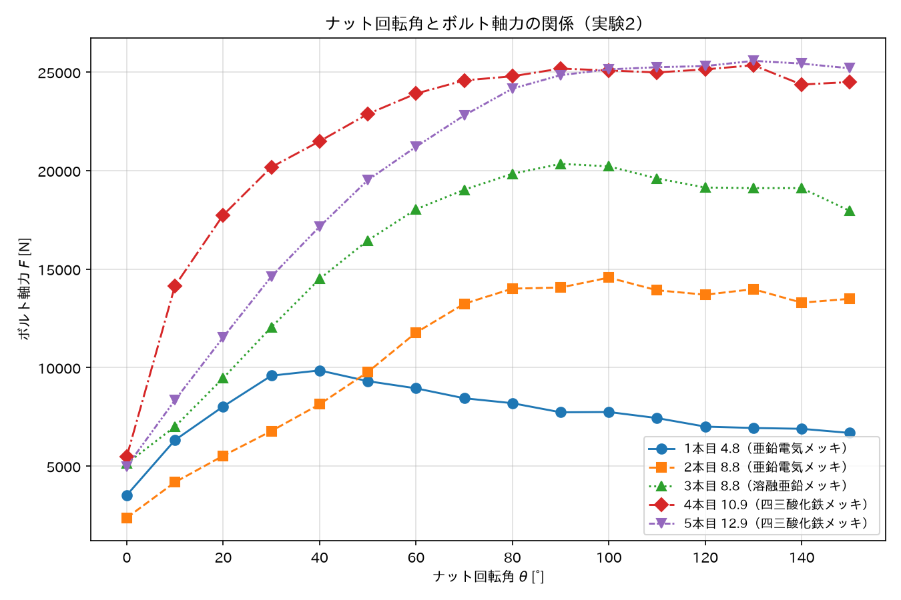

**図6　ナット回転角とボルト軸力の関係（実験2）**

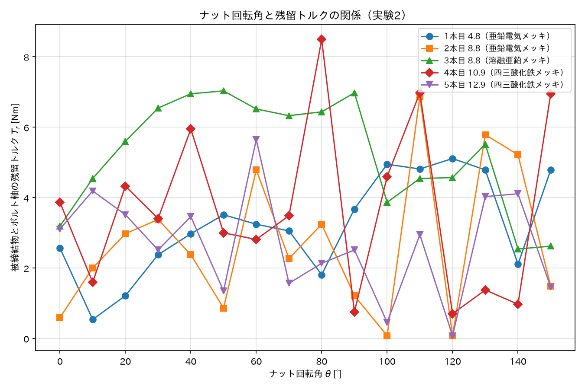

**図7　ナット回転角と残留トルクの関係（実験2）**

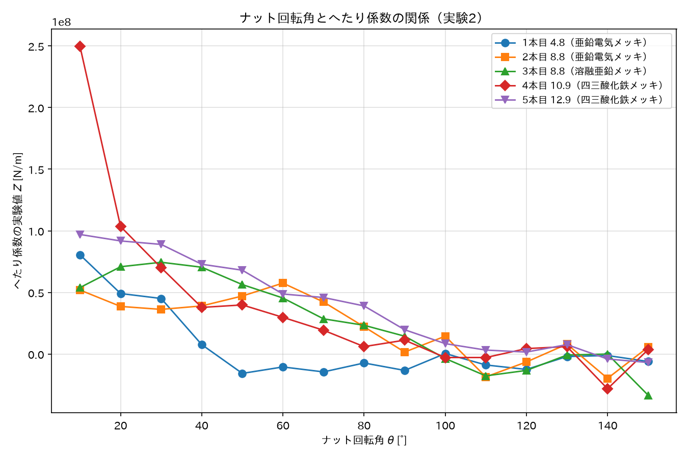

**図8　ナット回転角とへたり係数の関係（実験2）**

### 5.3 実験3　トルク勾配法によるねじ締結

各ボルトについて、ナット回転角$\theta$ごとのCH1・CH2測定値と、3.2節の式で算出したボルト軸力$F$、締付トルク$T_f$、被締結物とボルト軸の残留トルク$T_r$を表5.11〜5.15に示す。$T_r$は実験1の$T_w$と同じ式$T_r=\varepsilon_2 E_c Z_p/(1+\nu)$で算出した値だが、実験2・3では締付トルクを保持しない状態（回転角固定後）で読み取るため、指導書の呼称にならい「残留トルク」と表記する。勾配$\Delta T_f/\Delta\theta$は直前の測定点との間の締付トルクの変化量を回転角の変化量で除した値で、4.3節の手順④の終了判定に用いた（スナグトルクの点は勾配の計算に含めない）。

**表5.11　1本目（強度区分4.8、亜鉛電気メッキ）**

| $\theta$ [°] | CH1 | CH2 | $F$ [N] | $T_f$ [Nm] | $\Delta T_f/\Delta\theta$ [Nm/°] | $T_r$ [Nm] |
| ---: | ---: | ---: | ---: | ---: | ---: | ---: |
| 0 | -229 | -7 | 3201.2 | 10 | − | 0.189 |
| 10 | -347 | -149 | 4850.7 | 14 | 0.4 | 4.030 |
| 20 | -515 | -202 | 7199.1 | 18 | 0.4 | 5.464 |
| 30 | -667 | -218 | 9323.9 | 24 | 0.6 | 5.896 |
| 40 | -752 | -218 | 10512.1 | 26 | 0.2 | 5.896 |
| 50 | -771 | -182 | 10777.7 | 27 | 0.1 | 4.923 |
| 60 | -741 | -204 | 10358.3 | 26 | -0.1 | 5.518 |
| 70 | -702 | -171 | 9813.1 | 27 | 0.1 | 4.625 |
| 80 | -661 | -188 | 9240.0 | 28 | 0.1 | 5.085 |
| 90 | -631 | -213 | 8820.6 | 28 | 0.0 | 5.761 |
| 100 | -600 | -163 | 8387.3 | 27 | -0.1 | 4.409 |
| 110 | -583 | -164 | 8149.7 | 28 | 0.1 | 4.436 |
| 120 | -571 | -163 | 7981.9 | 26 | -0.2 | 4.409 |
| 130 | -537 | -182 | 7506.6 | 26 | 0.0 | 4.923 |

**表5.12　2本目（強度区分8.8、亜鉛電気メッキ）**

| $\theta$ [°] | CH1 | CH2 | $F$ [N] | $T_f$ [Nm] | $\Delta T_f/\Delta\theta$ [Nm/°] | $T_r$ [Nm] |
| ---: | ---: | ---: | ---: | ---: | ---: | ---: |
| 0 | -222 | -27 | 3103.3 | 10 | − | 0.730 |
| 10 | -312 | -128 | 4361.4 | 11 | 0.1 | 3.462 |
| 20 | -452 | -169 | 6318.4 | 19 | 0.8 | 4.571 |
| 30 | -641 | -191 | 8960.4 | 24 | 0.5 | 5.166 |
| 40 | -853 | -27 | 11923.9 | 21 | -0.3 | 0.730 |
| 50 | -974 | -273 | 13615.4 | 38 | 1.7 | 7.384 |
| 60 | -1013 | -251 | 14160.6 | 40 | 0.2 | 6.789 |
| 70 | -1007 | -247 | 14076.7 | 41 | 0.1 | 6.681 |
| 80 | -992 | -229 | 13867.0 | 39 | -0.2 | 6.194 |
| 90 | -1001 | -226 | 13992.8 | 35 | -0.4 | 6.113 |

**表5.13　3本目（強度区分8.8、溶融亜鉛メッキ）**

| $\theta$ [°] | CH1 | CH2 | $F$ [N] | $T_f$ [Nm] | $\Delta T_f/\Delta\theta$ [Nm/°] | $T_r$ [Nm] |
| ---: | ---: | ---: | ---: | ---: | ---: | ---: |
| 0 | -176 | -77 | 2460.3 | 10 | − | 2.083 |
| 10 | -421 | -168 | 5885.1 | 16 | 0.6 | 4.544 |
| 20 | -588 | -217 | 8219.6 | 21 | 0.5 | 5.869 |
| 30 | -801 | -270 | 11197.0 | 26 | 0.5 | 7.303 |
| 40 | -978 | -307 | 13671.3 | 30 | 0.4 | 8.304 |
| 50 | -1132 | -317 | 15824.0 | 31 | 0.1 | 8.574 |
| 60 | -1223 | -344 | 17096.1 | 36 | 0.5 | 9.304 |
| 70 | -1228 | -348 | 17166.0 | 39 | 0.3 | 9.413 |
| 80 | -1226 | -323 | 17138.0 | 39 | 0.0 | 8.736 |
| 90 | -1265 | -334 | 17683.2 | 39 | 0.0 | 9.034 |

**表5.14　4本目（強度区分10.9、四三酸化鉄メッキ）**

| $\theta$ [°] | CH1 | CH2 | $F$ [N] | $T_f$ [Nm] | $\Delta T_f/\Delta\theta$ [Nm/°] | $T_r$ [Nm] |
| ---: | ---: | ---: | ---: | ---: | ---: | ---: |
| 0 | -400 | -97 | 5591.5 | 10 | − | 2.624 |
| 10 | -572 | -154 | 7995.9 | 15 | 0.5 | 4.165 |
| 20 | -756 | -207 | 10568.0 | 19 | 0.4 | 5.599 |
| 30 | -963 | -228 | 13461.6 | 23 | 0.4 | 6.167 |
| 40 | -1157 | -272 | 16173.5 | 27 | 0.4 | 7.357 |
| 50 | -1338 | -267 | 18703.7 | 31 | 0.4 | 7.222 |
| 60 | -1503 | -290 | 21010.2 | 32 | 0.1 | 7.844 |
| 70 | -1600 | -367 | 22366.1 | 39 | 0.7 | 9.927 |
| 80 | -1690 | -210 | 23624.2 | 38 | -0.1 | 5.680 |
| 90 | -1721 | -380 | 24057.6 | 42 | 0.4 | 10.278 |
| 100 | -1686 | -345 | 23568.3 | 40 | -0.2 | 9.331 |
| 110 | -1728 | -330 | 24155.4 | 42 | 0.2 | 8.926 |
| 120 | -1737 | -376 | 24281.2 | 44 | 0.2 | 10.170 |

**表5.15　5本目（強度区分12.9、四三酸化鉄メッキ）**

| $\theta$ [°] | CH1 | CH2 | $F$ [N] | $T_f$ [Nm] | $\Delta T_f/\Delta\theta$ [Nm/°] | $T_r$ [Nm] |
| ---: | ---: | ---: | ---: | ---: | ---: | ---: |
| 0 | -322 | -56 | 4501.2 | 10 | − | 1.515 |
| 10 | -497 | -171 | 6947.5 | 12 | 0.2 | 4.625 |
| 20 | -713 | -222 | 9966.9 | 16 | 0.4 | 6.005 |
| 30 | -944 | -257 | 13196.0 | 22 | 0.6 | 6.951 |
| 40 | -1177 | -101 | 16453.1 | 24 | 0.2 | 2.732 |
| 50 | -1366 | -313 | 19095.1 | 27 | 0.3 | 8.466 |
| 60 | -1517 | -312 | 21205.9 | 27 | 0.0 | 8.439 |
| 70 | -1635 | -345 | 22855.4 | 30 | 0.3 | 9.331 |
| 80 | -1730 | -369 | 24183.4 | 32 | 0.2 | 9.981 |
| 90 | -1800 | -345 | 25161.9 | 35 | 0.3 | 9.331 |
| 100 | -1843 | -323 | 25763.0 | 34 | -0.1 | 8.736 |
| 110 | -1854 | -359 | 25916.8 | 34 | 0.0 | 9.710 |
| 120 | -1866 | -361 | 26084.5 | 38 | 0.4 | 9.764 |
| 130 | -1854 | -359 | 25916.8 | 39 | 0.1 | 9.710 |
| 140 | -1848 | -347 | 25832.9 | 35 | -0.4 | 9.386 |
| 150 | -1833 | -254 | 25623.2 | 33 | -0.2 | 6.870 |

ナット回転角$\theta$とボルト軸力$F$の関係を図9に、締付トルク$T_f$の関係を図10に、残留トルク$T_r$の関係を図11に示す。

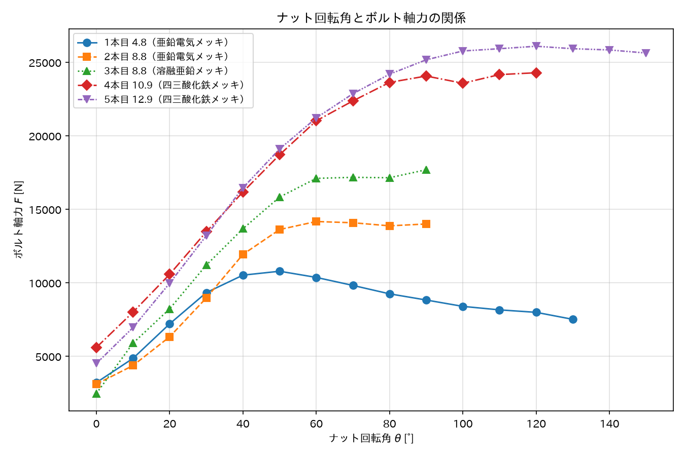

**図9　ナット回転角とボルト軸力の関係（実験3）**

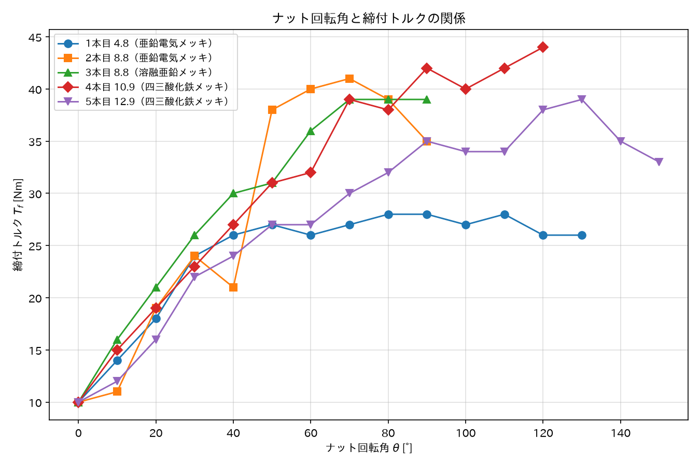

**図10　ナット回転角と締付トルクの関係（実験3）**

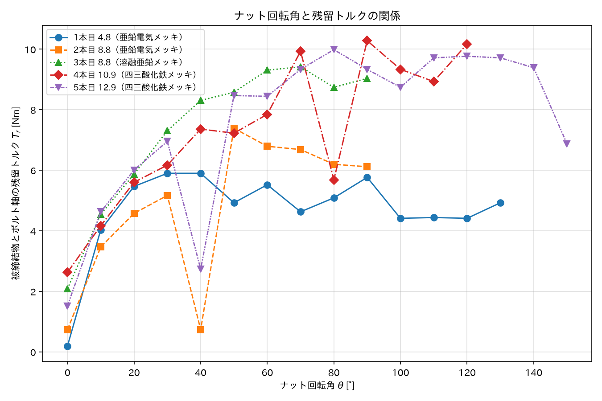

**図11　ナット回転角と残留トルクの関係（実験3）**

各ボルトの終了判定に関わる値（スナグトルクから最初の10°までの弾性域勾配、その1/2にあたる終了判定の閾値、勾配が閾値以下になった最初の回転角、実際に実験を終了した回転角）を表5.16に示す。あわせてナット回転角と勾配$\Delta T_f/\Delta\theta$の関係を図12に示す。

**表5.16　実験3の終了判定に関する値**

| ボルト | 弾性域勾配（0→10°）[Nm/°] | 終了判定の閾値（1/2）[Nm/°] | 勾配が閾値以下になった最初の$\theta$ [°] | 実験終了時の$\theta$ [°] |
| :--- | ---: | ---: | ---: | ---: |
| 1本目（4.8） | 0.4 | 0.2 | 40 | 130 |
| 2本目（8.8電気） | 0.1 | 0.05 | 40 | 90 |
| 3本目（8.8溶融） | 0.6 | 0.3 | 50 | 90 |
| 4本目（10.9） | 0.5 | 0.25 | 60 | 120 |
| 5本目（12.9） | 0.2 | 0.1 | 60 | 150 |

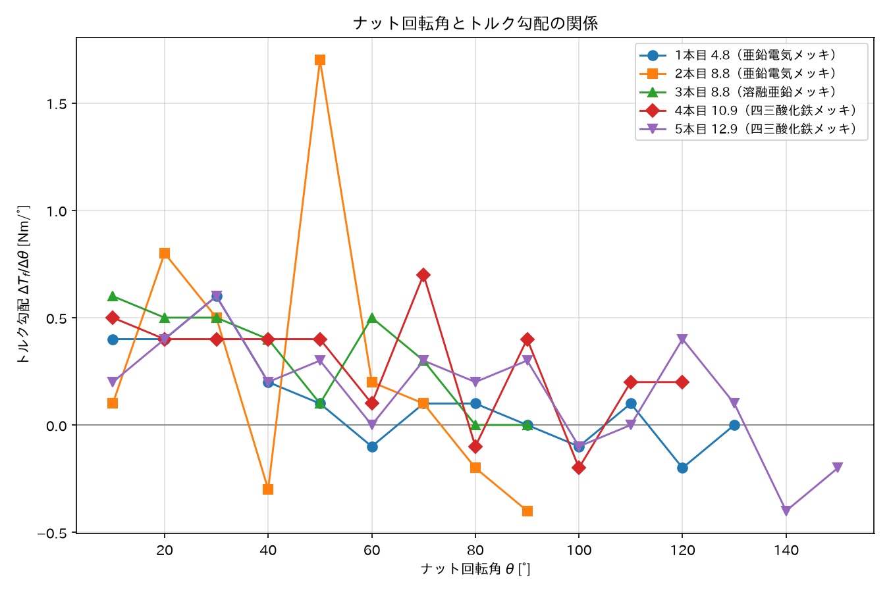

**図12　ナット回転角とトルク勾配の関係（実験3）**

## 6. 考察

### 6.1 実験1　トルク法によるねじ締結

#### (1) 締付トルクと軸力の関係

図1より、いずれのボルトも締付トルクとボルト軸力はほぼ直線関係にあり、弾性域での締付が行われたことがわかる。一方、同じ締付トルクで得られる軸力は表面処理によって大きく異なり、最終測定点における軸力とトルクの比$F/T_f$は、四三酸化鉄メッキの4本目・5本目で696N/Nm・615N/Nmであるのに対し、亜鉛系メッキの1〜3本目では363〜438N/Nmにとどまった。これは後述の通り四三酸化鉄メッキの摩擦係数が小さく、入力トルクのうち摩擦で消費される割合が小さいためと考えられる。トルク法では摩擦係数の影響で同一トルクでも軸力が2倍近く変わり得ることが確認でき、「接触部分の摩擦係数などの影響による誤差が大きい」というトルク法の特徴と一致する。

#### (2) 締付トルクの内訳

締付トルクの内訳は、ねじ部の摩擦トルクが40%程度、軸力増加のためのトルクが10%程度、座面の摩擦トルクが50%程度とされている。各ボルトの最終測定点における実験値の内訳を表6.1に示す。ねじ部の摩擦トルクは$T_s$から軸力増加分$FP/(2\pi)$を差し引いて求めた。

**表6.1　最終測定点における締付トルクの内訳**

| ボルト | $T_f$ [Nm] | 座面摩擦 [%] | ねじ部摩擦 [%] | 軸力増加 [%] |
| :--- | ---: | ---: | ---: | ---: |
| 1本目（4.8） | 15 | 29.4 | 61.9 | 8.7 |
| 2本目（8.8） | 25 | 22.7 | 70.0 | 7.2 |
| 3本目（8.8） | 25 | 36.8 | 55.6 | 7.6 |
| 4本目（10.9） | 35 | 28.1 | 58.1 | 13.8 |
| 5本目（12.9） | 40 | 24.4 | 63.4 | 12.2 |

軸力増加分は7.2〜13.8%であり、目安とされる10%程度とよく一致した。一方、座面摩擦は22.7〜36.8%と目安の50%程度より小さく、ねじ部摩擦は55.6〜70.0%と目安の40%程度より大きかった。座面摩擦の割合が小さくなった要因としては、座金の使用により座面の摩擦状態が良好であったこと、また本実験の試料はねじ部にメッキ処理が施されておりねじ面の摩擦が相対的に大きかったことが考えられる。

#### (3) 表面処理による摩擦係数の違い

図5より、ねじ部の摩擦係数$\mu_s$は表面処理により明確に異なった。測定点の平均値は、亜鉛電気メッキの2本目（8.8）で0.49、溶融亜鉛メッキの3本目（8.8）で0.37、亜鉛電気メッキの1本目（4.8）で0.30、四三酸化鉄メッキの4本目・5本目で0.16・0.19であった。亜鉛系メッキ（0.30〜0.49）に対し、皮膜が数μmと薄い四三酸化鉄メッキは0.2以下と明確に小さく、同じトルクで効率よく軸力を得られる。高強度ボルト（10.9・12.9）に四三酸化鉄メッキが採用されるのは、電気メッキの過程で発生する水素が遅れ破壊の原因となることを避ける目的もある。

一方、皮膜が50μm程度と厚く表面が粗い溶融亜鉛メッキの3本目（0.37）が、電気メッキの2本目（0.49）より小さいという結果は、皮膜の厚さ・粗さから予想される傾向と逆である。ただし(5)で述べるように3本目は$T_w$を過大に測定した疑いがあり、その場合$T_s=T_f-T_w$が過小となり$\mu_s$も過小に算出されるため、この逆転は測定誤差による見かけのものである可能性がある。

図4より、座面の摩擦係数$\mu_w$は0.07〜0.18の範囲にあり、ねじ部ほど表面処理による差は大きくない。また多くのボルトで締付トルクの増加とともに$\mu_w$が緩やかに低下する傾向が見られた。これは締付の進行により座面のなじみが進んだためと推測される。逆に$\mu_s$は締付トルクとともに漸増する傾向があり（特に4本目・5本目）、面圧の増大によりねじ面のメッキ皮膜の凝着が進んだためと推測される。

#### (4) 5本目の高トルク域での軸力の頭打ち

表5.5より、5本目では締付トルク30→35Nmで軸力が2683N増加したのに対し、35→40Nmでは1300Nしか増加しておらず、高トルク域で軸力の増加が鈍っている。40Nm時の軸力$F=24600$Nをねじ部有効断面積$A_s=40.6$mm²で除した引張応力は約606MPaであり、強度区分12.9の下降伏点（0.2%耐力）の目安である1080MPa（=1200MPa×0.9）に対して約56%にとどまるため、ボルトの降伏が原因とは考えにくい。同じ区間で$\mu_s$が0.214から0.248へ増大していることから、高面圧によるねじ面の摩擦増大が軸力の頭打ちの主因と推測される。

#### (5) 3本目の測定値の異常について

表5.3および図4より、3本目は15Nm以降でねじれひずみ（CH2）が急増し、$\mu_w$が0.13程度から0.17〜0.18へ不連続に増加している。2本目（同じ強度区分8.8）の$\mu_w$が0.115〜0.134の範囲で安定していることと比較すると、この変化は不自然である。実験時の記録によると、3本目の測定ではひずみの読み取り中にトルクレンチを保持し続けることができておらず、トルクが変動した状態で読み取った可能性がある。本レポートでは測定値をそのまま記載したが、3本目の15Nm以降の$T_w$・$\mu_w$は信頼性が低いと考えられる。

### 6.2 実験2　ナット回転角法によるねじ締結

#### (1) 強度区分がボルト軸力の推移に及ぼす影響

図6より、実験3と同様に、いずれのボルトも回転角の増加とともにボルト軸力$F$が増加した後に頭打ちとなり、低い強度区分ほど早い回転角でピークを迎えて低下も大きい傾向が見られた。1本目（4.8）は$\theta=40°$で$F=9855$Nのピークを迎えた後、$\theta=150°$までに約32%（9855N→6682N）低下した。2本目（8.8電気）・3本目（8.8溶融）はそれぞれ$\theta=100°$・$90°$付近でピーク（14566N、20339N）を迎え、その後7〜12%程度低下した。4本目（10.9）・5本目（12.9）は$\theta=130°$付近までほぼ単調に増加し、その後の低下も3%程度にとどまった。この傾向は6.3節(1)で示した実験3の結果と一致しており、強度区分が低いボルトほど少ない回転角で塑性域に達し軟化が進むという傾向が、異なる2つの実験から確認できた。

#### (2) 弾性域におけるへたり係数の実験値と理論値の比較

指導書の実験結果のまとめ③に対応するへたり係数の実験値$Z$は、図8より回転角の増加とともに理論値（表3.2の$Z=1.47\times10^8$N/m）に近い正の値から徐々に低下し、多くのボルトで$\theta=90°$前後から負の値に転じている。この転換点は(1)で示した軸力のピーク回転角とおおむね対応しており、$Z$の符号が塑性域への到達を判定する指標になり得ることを示している。

弾性域とみなせる$\theta=10°$〜$30°$における$Z$の平均値（4本目は$\theta=10°$の値が他と比べて明らかに大きく異常であるため$\theta=20°$・$30°$のみで平均）と、表3.2の理論値$1.47\times10^8$N/mとの比較を表6.2に示す。

**表6.2　弾性域におけるへたり係数の実験値と理論値の比較**

| ボルト | 実験値$Z$の平均（$\theta=10$〜$30°$）[×10⁷N/m] | 理論値$Z$ [×10⁷N/m] | 誤差 [%] |
| :--- | ---: | ---: | ---: |
| 1本目（4.8） | 5.82 | 14.7 | -60.4 |
| 2本目（8.8電気） | 4.22 | 14.7 | -71.3 |
| 3本目（8.8溶融） | 6.64 | 14.7 | -54.8 |
| 4本目（10.9、$\theta=20$・$30°$のみ） | 8.68 | 14.7 | -41.0 |
| 5本目（12.9） | 9.26 | 14.7 | -37.0 |

表6.2より、いずれのボルトも弾性域とみなした回転角の範囲における実験値は理論値より37〜71%小さかった。理論値$Z=K_BK_C/(K_B+K_C)$はボルト・被締結物とも理想的な弾性体としてのばね定数から算出した値であるのに対し、実験値は10°刻みという粗い回転角の差分から求めた平均勾配であり、この区間には座面・ねじ面の当たりが馴染む初期のなじみ変形（塑性的な沈み込み）も含まれてしまう。実験値が理論値を大きく下回ったのは、この初期なじみ変形の影響で見かけの剛性が低く算出されたためと考えられる。

#### (3) 測定値の異常について

図7・図8を見ると、実験2は残留トルク$T_r$・へたり係数$Z$のいずれも測定点ごとの変動が大きく、単発的な異常値というより実験全体を通してばらつきの大きいデータであると言える。これはトルク法（実験1）のように締付トルクという安定した制御量を基準に測定するのではなく、ナット回転角という機械的な変位を基準にしながら、10°というごく短い区間ごとのひずみ・軸力の差分（$T_r$、特に$Z$）を扱っているためと考えられる。座面・ねじ面の当たり具合、ひずみゲージの接着状態や信号のわずかな揺らぎ、ナット回転時の微小な滑り（スティックスリップ）といった測定条件そのものが、10°刻みの差分値には敏感に表れてしまう。したがって、以下に挙げる際立った値も、記入時の転記ミスというよりは、こうした測定上の要因によって生じたばらつきと考えるのが妥当である。

表5.9（4本目）の$\theta=10°$では、スナグトルク（$\theta=0°$、$F=5480$N）からわずか10°の回転で軸力が$F=14147$Nまで急増しており、その間の$Z$は$2.50\times10^8$N/mと、他のボルトの同区間（$0.5$〜$1.0\times10^8$N/m程度）や理論値（$1.47\times10^8$N/m）を大きく上回っている。他の4本はいずれもスナグトルクから最初の10°までの軸力増加が2000〜3400N程度にとどまることと比較すると、4本目のこの区間の増加（約8700N）は明らかに大きい。スナグトルク到達直後は座面・ねじ面の当たりがまだ十分になじんでおらず、ひずみゲージの応答も不安定になりやすい区間であるため、この急増は測定条件そのものに起因するばらつきであり、記入時の誤りではないと考えられる。また4本目・5本目（いずれも四三酸化鉄メッキ）はCH2（ねじりひずみ）の符号が測定点ごとに正負反転する箇所が多く見られ、1〜3本目（CH2は全区間で負に安定）と対照的である。この2本はねじりひずみの測定自体が座面のなじみの進行や局所的な滑りにより不安定であった可能性が高く、原因の特定には至らなかったが、こちらも測定条件に起因するものであり記入ミスではないと考えられる。

### 6.3 実験3　トルク勾配法によるねじ締結

#### (1) 強度区分がボルト軸力の推移に及ぼす影響

図9より、いずれのボルトも回転角の増加とともにボルト軸力$F$が増加するが、ある回転角を境に増加が頭打ちになり、1本目（4.8）と5本目（12.9）では明確な低下に転じた。1本目は$\theta=50°$で$F=10778$Nのピークを迎えた後、$\theta=130°$まで単調に低下し続け、最終的にピーク比で約30%（10778N→7507N）低下した。5本目は$\theta=120°$で$F=26085$Nのピークを迎えた後、$\theta=150°$までの低下は約1.8%（26085N→25623N）にとどまった。3本目（8.8溶融亜鉛）・4本目（10.9）は測定範囲内では明確な低下が見られず、実験終了時点でも軸力はわずかに増加傾向にあった。強度区分が低いボルトほど軸力のピークに早く到達し、ピーク後の軟化（低下）も顕著であった。これは、強度区分が低いボルトほど本実験で到達可能な回転角の範囲内で塑性変形が進みやすく、降伏後の応力緩和や座面・ねじ面のなじみの進行によって軸力自体が低下したためと考えられる。

また、同じ強度区分8.8でも、電気メッキの2本目は$\theta=60°$付近でピーク（14161N）を迎えてほぼ横ばいになったのに対し、溶融亜鉛メッキの3本目は測定終了（$\theta=90°$）まで軸力が増加し続けた。6.1節(3)で示した通りねじ部の摩擦係数は表面処理により異なるため、同一の強度区分でも塑性域への到達しやすさが表面処理によって変わり得ることを示唆している。

#### (2) 降伏開始時の引張応力と締め込み量の関係

軸力$F$がピーク（または測定範囲内での最大値）に達した回転角を、塑性変形が顕著になり始めた目安の点とみなし、そのときの軸力をねじ部有効断面積$A_s=4.06\times10^{-5}$m²で除した公称引張応力$\sigma=F/A_s$と、そのときのナットの締め込み量（表3.1の1°当たりの締め込み量$3.47\times10^{-6}$mを回転角に乗じた値）を表6.3に示す。3本目・4本目は測定終了時点でも軸力がまだ増加傾向にあったため、この値は真のピークではなく測定範囲内の最大値であることに注意する。

**表6.3　軸力ピーク時の引張応力と締め込み量**

| ボルト | ピーク時$\theta$ [°] | ピーク時$F$ [N] | $\sigma=F/A_s$ [MPa] | 締め込み量 [mm] | 公称0.2%耐力 [MPa] | 誤差 [%] |
| :--- | ---: | ---: | ---: | ---: | ---: | ---: |
| 1本目（4.8） | 50 | 10778 | 265.6 | 0.174 | 320 | -17.0 |
| 2本目（8.8電気） | 60 | 14161 | 349.0 | 0.208 | 640 | -45.5 |
| 3本目（8.8溶融、範囲内最大） | 90 | 17683 | 435.8 | 0.313 | 640 | -31.9 |
| 4本目（10.9、範囲内最大） | 120 | 24281 | 598.4 | 0.417 | 900 | -33.5 |
| 5本目（12.9） | 120 | 26085 | 642.8 | 0.417 | 1080 | -40.5 |

公称0.2%耐力は、強度区分の呼び（例：4.8→引張強さ400MPa×降伏比0.8）から6.1節(4)と同様に算出した目安値である。表6.3より、いずれのボルトも$\sigma=F/A_s$は公称0.2%耐力より17〜46%小さく、単純な引張のみで見積もった応力では実際の降伏点に届いていないことがわかる。これはねじ締結時のボルトが軸力による引張応力とねじれによるせん断応力の複合応力状態にあり、「ミーゼスの応力」が降伏点に達した時点で降伏するため、単純引張の場合よりも低い軸力で降伏することと定性的に一致する。ねじれによるせん断応力の分だけ実効的な降伏点が引張応力換算で低く見えるため、$\sigma=F/A_s$が公称0.2%耐力を下回ること自体は妥当な結果と考えられる。ただし本レポートではねじ部のせん断応力を厳密に評価していないため、ミーゼス応力による定量的な検証は今後の課題とする。

#### (3) 終了判定基準の妥当性

表5.16より、勾配$\Delta T_f/\Delta\theta$が終了判定の閾値（弾性域勾配の1/2）を初めて下回った回転角と、実際に実験を終了した回転角には、いずれのボルトも40〜90°程度の差があった（例：1本目は$\theta=40°$で閾値を下回ったが、実験終了は$\theta=130°$）。図12からも分かる通り、勾配は1点ごとの変動が非常に大きく、閾値を下回った直後に再び上回る例が多数見られる（1本目の$\theta=90°$→100°など）。このため、単発的に1点が閾値を下回っただけでは終了と判断せず、勾配が継続的に低い状態を目視で確認してから実験を終了したと考えられる。(1)で示した軸力$F$のピーク回転角（表6.3）は、1本目で$\theta=50°$、5本目で$\theta=120°$であり、いずれも実際の終了回転角（130°、150°）よりやや早い。したがって、軸力のピークの方が勾配の閾値判定よりも塑性域への到達をより早期に、かつ安定して検出できる指標であった可能性がある。

#### (4) 測定値の異常について

(3)で述べた通り、実験3も締付トルク$T_f$・残留トルク$T_r$を10°ごとの差分・勾配として扱うため、測定条件のわずかな揺らぎが数値に大きく表れやすい。図9〜図12を通して見ても、ほぼ全てのボルトで単調な増加ではなく細かい増減を繰り返しており、これは一部の測定点だけが特異なのではなく、手動でのひずみ・トルク読み取りとナット回転操作を10°刻みで繰り返すという実験3の測定方法そのものに起因するばらつきと考えられる。以下の2点は特にその振れ幅が大きかった例であり、いずれも記入時の転記ミスというより、測定時の座面のなじみ具合やひずみゲージの信号の揺らぎなど、計測上の要因によるものと考えられる。

表5.12（2本目）の$\theta=30°$から$50°$にかけて、締付トルク$T_f$は24→21→38Nmと推移しており、$\theta=40°$で一時的に減少した後、$\theta=50°$で単一の10°区間として実験3の中で最大の勾配（1.7Nm/°）を示している。回転を続けているにもかかわらずトルクが一時的に減少する挙動は、締付の進行中に座面やねじ面で局所的な滑り・なじみ直しが生じ、ひずみ・トルクの読み取り値が瞬間的に乱れたことによるものと考えられる。同様に、表5.15（5本目）の$\theta=40°$ではCH2が-101と、隣接する$\theta=30°$（-257）・$\theta=50°$（-313）に比べて絶対値が著しく小さく、残留トルク$T_r$も2.732Nmと前後の値（6.951Nm、8.466Nm）から大きく外れている。この点もねじりひずみの測定自体が瞬間的に不安定になった可能性が高い。6.1節(5)と同様に測定値はそのまま記載したが、これら2点は測定に起因するばらつきであり信頼性が低いと考えられる。

#### (5) トルク法・ナット回転角法・トルク勾配法の比較

3手法は締結管理の基準（制御量）が異なる。トルク法（実験1）は締付トルクを強度区分ごとの上限値まで加えるのみで弾性域内の締結にとどまるのに対し、ナット回転角法（実験2）はスナグトルク後のナット回転角を固定値（150°）まで進めることで塑性域まで踏み込み、トルク勾配法（実験3）はナット回転角を進めながら締付トルクの勾配（弾性域の1/2）を監視して塑性域への到達を都度判定する。このため実験1で得られる軸力は各ボルトの強度区分内で相対的に小さく、実験2・3では明確に大きな軸力が得られている（例えば5本目では実験1が$T_f=40$Nm時に$F=24600$N（表5.5）であったのに対し、実験2は$\theta=150°$で$F=25190$N（表5.10）、実験3は$\theta=150°$で$F=25623$N（表5.15）と、いずれも実験1を上回った）。ただし各実験は別個体のボルトを用いているため、個体差の影響を完全には排除できない。

#### (6) 強度区分がナット回転角法・トルク勾配法に及ぼす影響の相互検証

6.2節(1)と6.3節(1)で示した通り、実験2・実験3のいずれも強度区分が低いボルトほど軸力のピークに早く到達し、ピーク後の軟化が大きいという同じ傾向を示した。同一強度区分の軸力ピーク回転角を比較すると、1本目（4.8）は実験2で$\theta=40°$、実験3で$\theta=50°$、5本目（12.9）は実験2で$\theta=130°$、実験3で$\theta=120°$と、いずれも近い値であった。実験2と実験3は締結を終了させる基準（固定角度か勾配基準か）が異なるものの、軸力が実際にピークを迎える回転角自体はボルトの強度区分でほぼ決まっており、締結管理の方式にはあまり依存しないことが、別個体の2組の実験結果から確認できた。

#### (7) 降伏時の引張応力と締め込み量の関係（実験2による検証）

6.3節(2)（表6.3）と同様の考え方で、実験2における軸力ピーク時の公称引張応力$\sigma=F/A_s$を求めると、1本目242.9MPa（$\theta=40°$）、2本目358.9MPa（$\theta=100°$）、3本目501.2MPa（$\theta=90°$）、4本目624.6MPa（$\theta=130°$）、5本目630.0MPa（$\theta=130°$）となった。表6.3の実験3の値（265.6、349.0、435.8、598.4、642.8MPa）と比較すると、いずれのボルトも概ね近い値（1〜15%程度の差）であり、強度区分が高いボルトほど軸力ピーク時の引張応力も高いという傾向は両実験で一致している。3本目・4本目は実験3では測定終了時点でも軸力が増加中で真のピークを捉えられていなかったが、実験2では明確なピークが得られており（3本目501.2MPa、4本目624.6MPa）、実験3の値（435.8MPa、598.4MPa）がいずれも実験2の値を下回っていたことは、実験3の値が真のピークより低い範囲内最大値に過ぎないという6.3節(2)の注記と整合する。いずれの値も6.1節(4)・6.3節(2)で示した公称0.2%耐力（320〜1080MPa）を17〜46%下回っており、単純な引張応力ではなくミーゼスの応力（引張応力とねじれによるせん断応力の複合応力）が降伏点に達した時点で降伏するという説明と、実験2・3の両方の結果が定性的に一致した。
