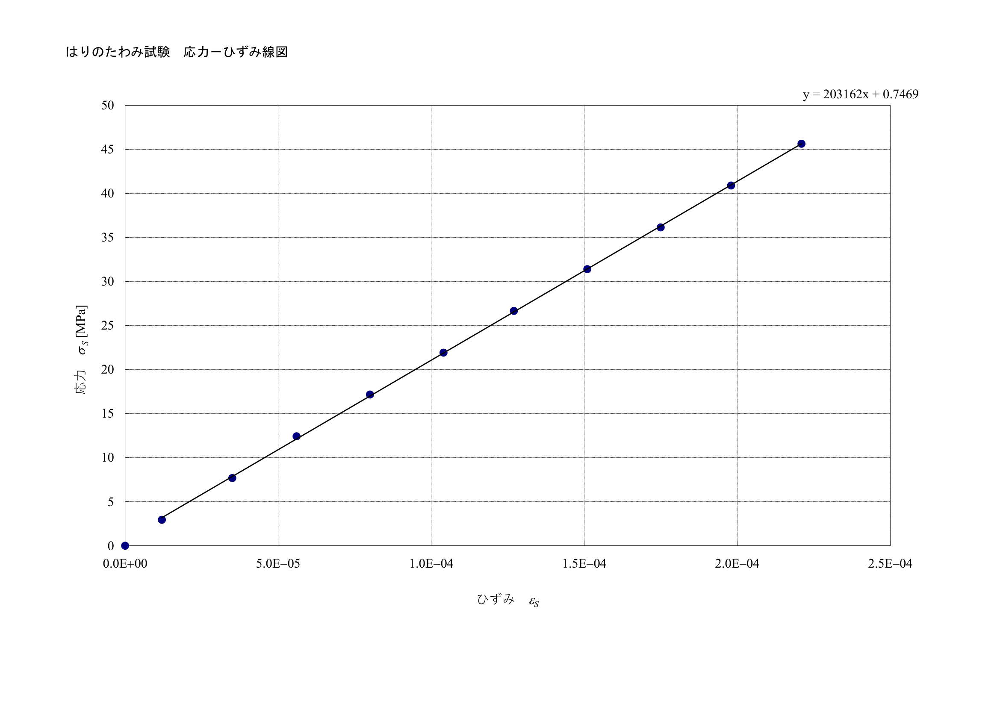
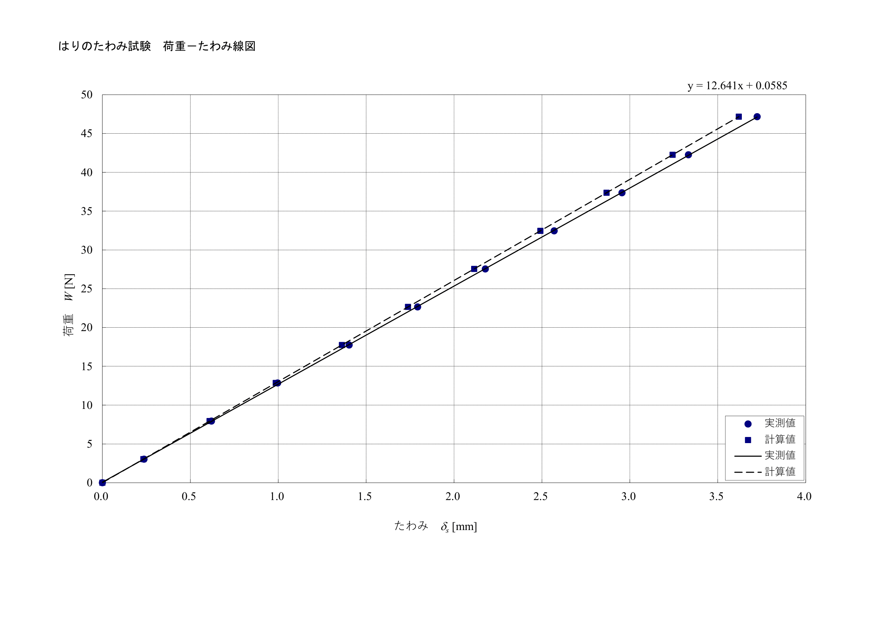
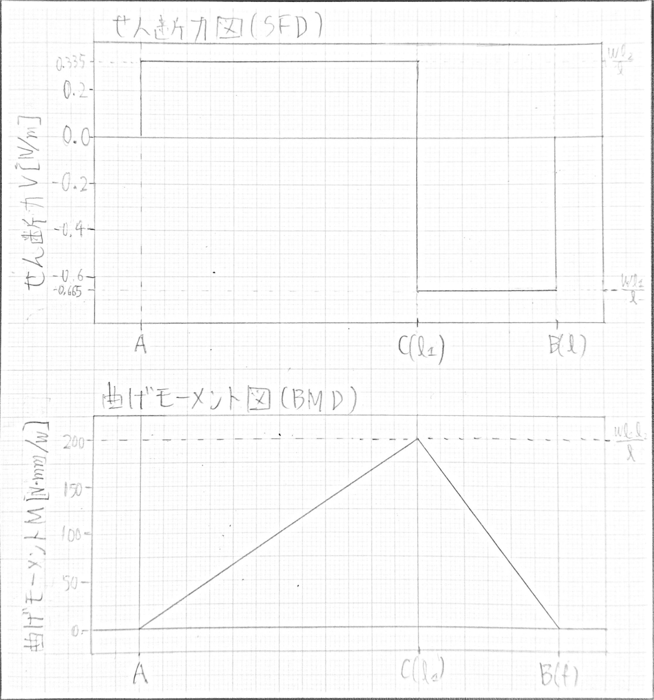

## 1. 目的

ひずみゲージおよび抵抗線ひずみ計の原理と測定方法を修得し、応力測定から得られるデータの処理方法を理解する。本実験では、両端単純支持ばりに集中荷重を負荷し、荷重点から離れた点のたわみとひずみをそれぞれダイヤルゲージとひずみゲージにより測定する。測定したひずみと荷重の関係から、実験的に縦弾性係数$E$を求め、さらにこの$E$を用いてはりのたわみの理論式から計算したたわみと、ダイヤルゲージによる実測値を比較する。

## 2. 使用機器

- ひずみゲージ（1ゲージ3線式、直交ゲージ、ゲージ率$K=2.11$）
- 静ひずみ計（データロガー、ブリッジ抵抗$R=120\,\Omega$、入力電圧$E_i=2\,$V）
- 試験片（SS400矩形断面のはり）
- 荷重装置
- ダイヤルゲージ
- ノギス

## 3. 実験原理

### 3.1 ひずみゲージによるひずみ測定

材料に外力が作用すると、材料内部に応力が発生し、これに比例したひずみが生じる。長さ$l$の材料が$\Delta l$だけ変形したとき、ひずみ$\varepsilon$は

$$
\varepsilon = \frac{\Delta l}{l}
$$

で定義される。ひずみゲージは、対象物の変形に追従して金属箔の電気抵抗が変化する現象を利用したセンサであり、この抵抗変化はホイートストーンブリッジ回路によって電圧変化として検出される。

### 3.2 はりの曲げ理論

断面形状が幅$b$、高さ$h$の矩形断面を有する長さ$l_1+l_2$の両端単純支持ばりに、支点Aから距離$l_1$の位置に集中荷重$W$が作用しているとする（図III-1）。支点A・Bの垂直方向反力$R_A$・$R_B$は、静力学的なつりあいより、

$$
R_A + R_B - W = 0 \tag{III-1}
$$

$$
R_A(l_1+l_2) - Wl_2 = 0 \tag{III-2}
$$

これを解くと、

$$
R_A = \frac{Wl_2}{l_1+l_2}, \quad R_B = \frac{Wl_1}{l_1+l_2} \tag{III-3,4}
$$

**AC間**（$0 \leq x \leq l_1$）の自由体図（図III-3）について、

$$
R_A + V = 0 \tag{III-5}
$$

$$
-R_Ax + M = 0 \tag{III-6}
$$

これを解くと、せん断力$V$および曲げモーメント$M$は、

$$
V = \frac{Wl_2}{l_1+l_2}, \quad M = \frac{Wl_2}{l_1+l_2}x \tag{III-7,8}
$$

**CB間**（$l_1 \leq x \leq l_1+l_2$）の自由体図（図III-4）について、

$$
-\frac{Wl_2}{l_1+l_2} + W + V = 0 \tag{III-9}
$$

$$
-\frac{Wl_2}{l_1+l_2}x + W(x-l_1) + M = 0 \tag{III-10}
$$

これを解くと、

$$
V = -\frac{Wl_1}{l_1+l_2}, \quad M = -\frac{Wl_1}{l_1+l_2}x + Wl_1 \tag{III-11,12}
$$

矩形断面の断面二次モーメント$I_y$および断面係数$Z$は、

$$
I_y = \int_A z^2\,dA = \int_{-h/2}^{h/2} z^2 b\,dz = \frac{bh^3}{12} \tag{III-13}
$$

$$
\sigma = \frac{M}{I_y}z \tag{III-14}
$$

$$
\sigma = \frac{M}{Z} \quad \left( \text{ここで、断面係数：} Z = \frac{I_y}{z_{\max}} = \frac{bh^2}{6} \right) \tag{III-15}
$$

はりのたわみの基礎式は、

$$
EI_y\frac{d^2w}{dx^2} = -M \tag{III-16}
$$

境界条件は支点A（$x=0$）・B（$x=l_1+l_2$）でたわみ$w$がゼロ、連続条件は荷重点C（$x=l_1$）でたわみ・たわみ角が連続となる。なお、本実験ではS点とD点は同一位置（$x_S=x_D$）に配置されており、D点はAC間にあるためたわみの計算はIII-17式を適用する。

S点の曲げモーメント・曲げ応力・D点のたわみはそれぞれ、

$$
M_S = \frac{Wl_2}{l_1+l_2}x_S \tag{III-19}
$$

$$
\sigma_S = \frac{M_S}{Z} \tag{III-20}
$$

$$
\delta_D = \frac{Wl_2 x_D}{6EI_y l}(l^2 - l_2^2 - x_D^2) \tag{III-21}
$$

## 4. 実験手順

1. はりの断面形状（幅$b$、高さ$h$）およびスパン（$l_1$、$l_2$）を測定し、断面二次モーメント$I_y$と断面係数$Z$を計算する。
2. S点とD点の位置$x_S$、$x_D$を記録する（本実験では$x_S=x_D$）。
3. 荷重$W$を0.5 kgf刻みで負荷し、各荷重段階でS点のひずみ$\varepsilon_S$とD点のたわみ$\delta_D$を測定する。
4. 測定した荷重・ひずみ・たわみのデータから、S点の曲げモーメント$M_S$、曲げ応力$\sigma_S$を計算する。

## 5. 実験結果

**表5.1　はりの断面形状・スパン**

| 幅$b$ (mm) | 高さ$h$ (mm) | 断面二次モーメント$I_y$ (mm⁴) | 断面係数$Z$ (mm³) |
|:---:|:---:|:---:|:---:|
| 10.25 | 9.98 | 849.1 | 170.2 |

| $l_1$ (mm) | $l$ (mm) | $l_2$ (mm) | $x_S$ (mm) | $x_D$ (mm) |
|:---:|:---:|:---:|:---:|:---:|
| 600.5 | 903 | 302.5 | 491.5 | 491.5 |

### 5.1 測定結果

**表5.2　はりの曲げ試験の測定結果**

| No. | 荷重$W$ (kgf) | $W$ (N) | $M_S$ (N·mm) | $\varepsilon_S$ (×10⁻⁶) | $\sigma_S$ (MPa) | $\delta_D$ 実測値 (mm) | $\delta_D$ 計算値 (mm) |
|:---:|:---:|:---:|:---:|:---:|:---:|:---:|:---:|
| 0  | 0.00 | 0.00  | 0.0    | 0    | 0.00  | 0.000 | 0.000 |
| 1  | 0.31 | 3.04  | 500.5  | −12  | 2.94  | 0.237 | 0.233 |
| 2  | 0.81 | 7.94  | 1307.9 | −35  | 7.69  | 0.620 | 0.610 |
| 3  | 1.31 | 12.85 | 2115.2 | −56  | 12.43 | 0.997 | 0.986 |
| 4  | 1.81 | 17.75 | 2922.5 | −80  | 17.18 | 1.403 | 1.362 |
| 5  | 2.31 | 22.65 | 3729.9 | −104 | 21.92 | 1.793 | 1.738 |
| 6  | 2.81 | 27.56 | 4537.2 | −127 | 26.67 | 2.178 | 2.114 |
| 7  | 3.31 | 32.46 | 5344.5 | −151 | 31.41 | 2.569 | 2.491 |
| 8  | 3.81 | 37.36 | 6151.9 | −175 | 36.16 | 2.955 | 2.867 |
| 9  | 4.31 | 42.27 | 6959.2 | −198 | 40.90 | 3.333 | 3.243 |
| 10 | 4.81 | 47.17 | 7766.5 | −221 | 45.64 | 3.724 | 3.619 |

*ひずみゲージをはりの圧縮側に貼付したため$\varepsilon_S$は負の値となっている。*

### 5.2 応力－ひずみ関係

S点の応力$\sigma_S$とひずみ$\varepsilon_S$（絶対値）をプロットし、その直線の勾配から縦弾性係数を求めた。

**図1　応力－ひずみ線図（はりのたわみ試験）**

グラフの回帰直線の勾配より、

$$
E_{実験} = 203{,}162\ \text{MPa}
$$

が得られた。

### 5.3 荷重－たわみ関係

実験的に求めた$E$を用い、式（III-21）からD点のたわみ$\delta_D$を荷重ごとに計算し、ダイヤルゲージによる実測値と比較した。

**図2　荷重－たわみ線図（はりのたわみ試験）**

## 6. 考察

### 6.1 縦弾性係数について

実験により得られた縦弾性係数は$E_{実験}=203{,}162$MPaであった。供試材料はSS400（一般構造用圧延鋼材）であり、文献値は$E_{文献}\fallingdotseq 205{,}000$MPaとされている\[1\]。両者を比較すると、

$$
\frac{E_{実験}-E_{文献}}{E_{文献}}\times100 \fallingdotseq -0.9\,\%
$$

となり、誤差は1%未満と非常に小さく、実験的に求めた縦弾性係数は文献値とよく一致した。わずかな差異の要因としては、ひずみゲージの貼付位置のずれ、断面寸法測定（ノギス）の読み取り誤差、および試験片材料自体のロット差などが考えられる。

### 6.2 $\varepsilon_S$の符号について

測定されたひずみ$\varepsilon_S$がすべて負の値であった。これは、ひずみゲージが集中荷重点よりも支点A側の位置（$x_S<l_1$）に貼付されており、AC間のはり上面は曲げによって圧縮側に位置するためである。ひずみゲージは圧縮ひずみに対して負の値を出力するため、この挙動は理論と一致している。

### 6.3 たわみの理論値と実測値の比較

D点のたわみについて、実測値は理論計算値とほぼ一致しており、グラフ上でも両者はほぼ重なる直線関係を示した。詳しく見ると、実測値は計算値に対してわずかに大きい傾向があり、全体を通じて差は最大約3.2%（No.4）、最小約1.1%程度であった。実測値の方が計算値より大きくなる要因としては、$l_1$、$l$、$x_S$を測定する際はりが試験機上で少しずれてしまったことが一番の原因である可能性が高い。他の原因としては支点・荷重点における機械的なガタや、試験片のわずかな初期たわみの影響が考えられるが試験結果の正確性を見るにこの影響は殆ど無いと思われる。全体として、理論（はりのたわみの式）と実験結果は良好に一致しており、式（III-21）の妥当性が実験的に確認された。

### 6.4 まとめ

本実験により、ひずみゲージを用いた応力・ひずみ測定の手法と、はりの曲げ理論（曲げ応力・たわみの式）を組み合わせることで、材料の縦弾性係数を精度よく求められることが確認できた。また、求めた縦弾性係数を用いて計算したたわみは、実測値と良好に一致し、理論式の妥当性が実験的に検証された。

---

## 7 課題

### 7.1　ひずみゲージの結線法について

ひずみゲージは、ホイートストーンブリッジ回路の一辺（または複数辺）に組み込んで使用する。ゲージとブリッジ測定器を接続するリード線の引き出し方によって、主に1ゲージ2線式、1ゲージ3線式、2ゲージ法の3種類の結線法がある。

**1ゲージ2線式**

ブリッジ回路の1辺にひずみゲージを、残りの3辺に固定抵抗を接続する、最も基本的な結線方法である[2]。構成が簡単で一般的な応力・ひずみ測定に広く用いられているが、ひずみゲージから測定器までのリード線の抵抗がゲージと直列にブリッジの1辺に挿入される形になる。あらかじめ平衡調整を行えば、リード線抵抗による誤差自体は補正できるが、測定中に温度変化が生じた場合、リード線の抵抗値の温度変化が測定結果に誤差として現れてしまう[3]。

**1ゲージ3線式**

1ゲージ2線式のリード線温度誤差を解消するため、ひずみゲージに3本のリード線を用いる結線法である。2本のリード線の抵抗が、ブリッジの隣り合う2辺（$R_1$・$R_2$）にそれぞれ均等に挿入される構成になっており、ブリッジ回路は対辺どうしの比（$R_1/R_2$と$R_3/R_4$）を比較する仕組みのため、両辺に同じだけ加わったリード線抵抗の影響は相殺される[3][4]。これにより、リード線が温度変化を受けても出力に影響が出にくく、測定中に温度変化が想定される場合に有効な結線法である。なお、3本のリード線は温度影響を同一にするため、種類・長さ・断面積をすべて揃える必要がある[4]。本実験で使用しているのはこの1ゲージ3線式である。

**2ゲージ法**

2枚のひずみゲージをブリッジ回路に組み込む結線法であり、温度補償や曲げ・ねじり成分の除去を目的とする場合に用いられる[5]。ゲージの貼付位置によって測定できる内容が異なり、例えば測定対象物の表と裏（中立軸を挟んで対称な位置）にそれぞれ貼付すると、曲げによる引張側・圧縮側のひずみが互いに加算され、2倍のひずみ出力が得られる[3]。また、測定対象と同じ材質で応力を受けない試料片に参照用ゲージを貼付し、温度変化による見かけのひずみをキャンセルする温度補償用途でも用いられる。

---

### 7.2　せん断力図（SFD）と曲げモーメント図（BMD）

実験に使用したはりの寸法（$l_1=600.5$mm、$l_2=302.5$mm、$l=903$mm）に対するSFDおよびBMDを図3に示す。

**図3　せん断力図（SFD）と曲げモーメント図（BMD）**

AC間のせん断力は$V=+Wl_2/l$、CB間では$V=-Wl_1/l$の一定値をとる。曲げモーメントは支点A・Bでゼロ、荷重点Cで最大値$M_C=Wl_1 l_2/l$をとる三角形分布となる。

---

### 7.3　たわみ角の式・たわみの式

はりのたわみの基礎式（III-16）を各区間で積分し、境界条件・連続条件から積分定数を定める。

**AC間**（$0\leq x \leq l_1$）では$M=\dfrac{Wl_2}{l}x$より、

$$
EI_y\frac{d^2w}{dx^2} = -\frac{Wl_2}{l}x
$$

1回積分してたわみ角の式を得る。

$$
EI_y\frac{dw}{dx} = -\frac{Wl_2}{2l}x^2 + C_1
$$

さらに1回積分してたわみの式を得る。

$$
EI_y\,w = -\frac{Wl_2}{6l}x^3 + C_1 x + C_2
$$

**CB間**（$l_1\leq x \leq l_1+l_2$）では$M=-\dfrac{Wl_1}{l}x+Wl_1$より、

$$
EI_y\frac{d^2w}{dx^2} = \frac{Wl_1}{l}x - Wl_1
$$

1回積分してたわみ角の式を得る。

$$
EI_y\frac{dw}{dx} = \frac{Wl_1}{2l}x^2 - Wl_1 x + C_3
$$

さらに1回積分してたわみの式を得る。

$$
EI_y\,w = \frac{Wl_1}{6l}x^3 - \frac{Wl_1}{2}x^2 + C_3 x + C_4
$$

**積分定数の決定**

境界条件$w(0)=0$より$C_2=0$。境界条件$w(l)=0$、連続条件（C点でのたわみ・たわみ角が一致）の3条件から$C_1$・$C_3$・$C_4$を定めると、

$$
C_1 = \frac{Wl_2}{6l}(l^2-l_2^2)
$$

**最終的なたわみの式**

AC間（$0\leq x \leq l_1$、$l=l_1+l_2$）：

$$
w = \frac{Wl_2 x}{6EI_y l}(l^2 - l_2^2 - x^2) \tag{III-17}
$$

CB間（$l_1\leq x \leq l_1+l_2$）：

$$
w = \frac{Wl_2 x}{6EI_y l}(l^2 - l_2^2 - x^2) + \frac{W}{6EI_y}(x-l_1)^3 \tag{III-18}
$$

**たわみ角の式**

AC間：

$$
\frac{dw}{dx} = \frac{Wl_2}{6EI_y l}(l^2 - l_2^2 - 3x^2)
$$

CB間：

$$
\frac{dw}{dx} = \frac{Wl_2}{6EI_y l}(l^2 - l_2^2 - 3x^2) + \frac{W}{2EI_y}(x-l_1)^2
$$

---

## 参考文献

[1] 施工管理の教科書．「SS400とは？降伏点、引張強さ、密度、ヤング率、許容応力など」．https://seko-kanri.com/ss400/　参照日:2026/6/29

[2] 共和電業．「ひずみゲージの結線法」．https://product.kyowa-ei.com/learn/strain-gages/wiring　参照日:2026/6/29

[3] Advantest．「ひずみ測定ノウハウ」．https://airlogger.advantest.com/ja/technical_support/information/know-how/strain　参照日:2026/6/29

[4] 共和電業．「リード線の温度影響の補償法（3線式結線法）」．https://product.kyowa-ei.com/learn/strain-gages/3_wire_system　参照日:2026/6/29

[5] キーエンス．「ひずみゲージ ブリッジ回路の組み方」．https://www.keyence.co.jp/ss/products/recorder/lab/strain/straingage.jsp　参照日:2026/6/29