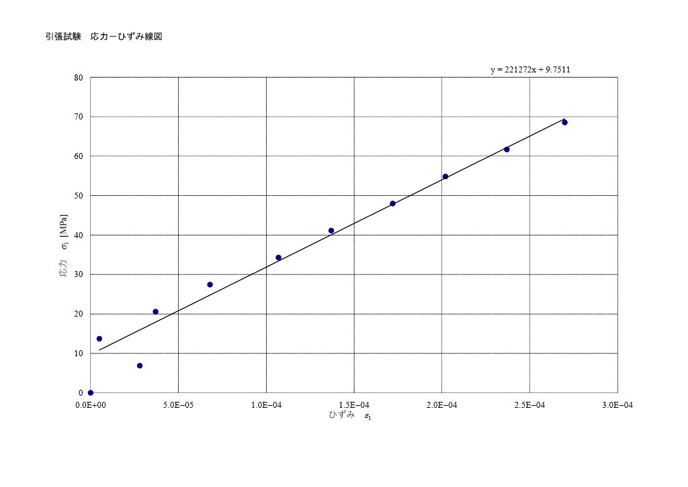

## 1. 目的

ひずみゲージおよび抵抗線ひずみ計の原理と測定方法を修得し，応力測定から得られるデータの処理方法を理解する．本実験では，平板（材質：SS400）の長手方向とそれに直角方向にひずみゲージを接着し，引張荷重を加えることで単軸応力状態を作り出す．このときの応力とひずみを測定することにより，材料の縦弾性係数$E$を実験的に求める．

## 2. 使用機器

- ひずみゲージ（1ゲージ3線式，直交ゲージ，ゲージ率$K=2.11$）
- 静ひずみ計（データロガー，ブリッジ抵抗$R=120\,\Omega$，入力電圧$E_i=2\,$V）
- 試験片（SS400平板）および引張荷重装置（ロードセル使用）
- ノギス

## 3. 実験原理

### 3.1 ひずみゲージとブリッジ回路

材料に引張力$P$が作用すると，これに対する応力$\sigma$が材料内部に発生し，これに比例した引張ひずみが生じる．ひずみゲージは，対象物の変形に追従して金属箔の電気抵抗が変化する現象を利用したセンサであり，この抵抗変化はホイートストーンブリッジ回路によって電圧変化として検出される．本実験では，同一点で縦方向・横方向の2方向のひずみを同時に測定できる直交ゲージを使用し，1ゲージにつき3本のリード線で接続する3線式結線によりブリッジまでの引出し線の影響を抑えている．使用したゲージのゲージ率は$K=2.11$であった．

### 3.2 引張試験の理論

平板の板幅を$b$，板厚を$t$とし，軸方向荷重を$P$とすると，平板の軸方向の垂直応力$\sigma_1$は，断面積$A=bt$より

$$
\sigma_1 = \frac{P}{bt} \tag{II-1}
$$

で求められる．また，縦弾性係数を $E$，軸方向ひずみ（縦ひずみ）を$\varepsilon_1$とすれば，フックの法則より

$$
\sigma_1 = E\varepsilon_1 \tag{II-2}
$$

が成り立つ．ポアソン比$\nu$は，縦ひずみと横方向ひずみ（横ひずみ）$\varepsilon_2$の比であるので

$$
\nu = -\frac{\varepsilon_2}{\varepsilon_1} \tag{II-3}
$$

として求められる．

## 4. 実験手順

1. 平板の板厚 $t$，板幅$b$をノギスでそれぞれ3点測定し，その平均値から断面積$A=bt$を求めた．
2. 材料の降伏応力を$\sigma_y \fallingdotseq 40\,\text{kgf/mm}^2 \,(\fallingdotseq 392\,\text{MPa})$とし，安全率5を考慮した許容引張応力$\sigma_a = \sigma_y / 5 \fallingdotseq 8\,\text{kgf/mm}^2\,(\fallingdotseq 78.4\,\text{MPa})$から，許容引張荷重$P_a=\sigma_a A$を計算した．
3.$P_a$（計算上2861kgf）の1/10ずつ荷重$P$を負荷し，縦ひずみ$\varepsilon_1$と横ひずみ$\varepsilon_2$を測定した．ただし，3000kgfでは降伏応力を超えるおそれがあるため，実際の負荷は0〜2500kgf（250kgf刻み）の範囲とした．

## 5. 実験結果

### 5.1 試験片の断面形状等

**表5.1　試験片の断面形状等**
| 板幅 $b$ (mm) | 板厚 $t$ (mm) | 断面積 $A$ (mm²) | 許容引張荷重 $P_a$ (kgf) |
|:---:|:---:|:---:|:---:|
| 40.01 | 8.94 | 357.7 | 2861 |

※板幅・板厚はそれぞれ3点測定の平均値：板厚 8.94, 8.95, 8.94 mm／板幅 39.96, 40.00, 40.07 mm

### 5.2 引張試験の測定結果

**表5.2　引張試験の測定結果**
| No. | 荷重 $P$ (kgf) | $P$ (N) | $\varepsilon_1$ (×10⁻⁶) | $\sigma_1$ (MPa) | $\varepsilon_2$ (×10⁻⁶) |
|:---:|:---:|:---:|:---:|:---:|:---:|
| 0 | 0    | 0     | 0   | 0.0  | — |
| 1 | 250  | 2452  | 28  | 6.9  | — |
| 2 | 500  | 4903  | **5**  | 13.7 | — |
| 3 | 750  | 7355  | 37  | 20.6 | — |
| 4 | 1000 | 9807  | 68  | 27.4 | — |
| 5 | 1250 | 12258 | 107 | 34.3 | — |
| 6 | 1500 | 14710 | 137 | 41.1 | — |
| 7 | 1750 | 17162 | 172 | 48.0 | — |
| 8 | 2000 | 19613 | 202 | 54.8 | — |
| 9 | 2250 | 22065 | 237 | 61.7 | — |
| 10 | 2500 | 24517 | 270 | 68.5 | — |

※横ひずみ$\varepsilon_2$は，実験中にひずみゲージが断線したため測定データが得られなかった．

### 5.3 応力とひずみの関係

応力$\sigma_1$と縦ひずみ$\varepsilon_1$の関係をグラフにしたものを図1に示す（Excelにて作成）．

**図1　応力－ひずみ線図（引張試験）**

全11点のデータに対し最小二乗法による回帰直線を求めたところ，直線の式は $y = 221272x + 9.75$ となり，その勾配から

$$
E_{実験} = 221{,}272\ \text{MPa}
$$

が得られた．

## 6. 考察

### 6.1 縦弾性係数について

図1の回帰直線（全11点を用いたもの）から得られた縦弾性係数は$E_{実験}=221{,}272$MPaであった．SS400の文献値は$E_{文献}\fallingdotseq205{,}000$MPaとされており[1]，比較すると

$$
\frac{E_{実験}-E_{文献}}{E_{文献}}\times100 \fallingdotseq +7.9\,\%
$$

となり，文献値との差はやや大きい．

この誤差の主な要因として，後述するNo.2（$P=500$kgf）の測定値の異常（6.2節参照）と，低荷重域（No.1，$P=250$kgf）に見られる試験片の初期なじみによる非線形性が，回帰直線の傾きを実際よりも大きく見積もらせていることが考えられる．これら2点を除き，比較的安定した直線区間（$P=750\sim2500$kgfの8点）のみで再度回帰すると，

$$
E_{補正後} = 205{,}630\ \text{MPa}\quad (R^2 = 0.9996)
$$

となり，文献値との誤差は$+0.3\,\%$まで大幅に改善する．このことから，外れ値や初期の非線形領域を適切に見極めて除外することが，縦弾性係数を精度よく求める上で重要であることが確認できた．

### 6.2 No.2の異常値について

No.2（$P=500$kgf）のひずみ値（$5\times10^{-6}$）は，前後の測定点（$P=250$ kgfで$28\times10^{-6}$，$P=750$ kgfで$37\times10^{-6}$）から考えて，本来であれば50×10⁻⁶前後になると予想される．

この異常値の原因としては，荷重を500kgfまで上げる段階で，当初250kgf刻みで一段ずつ止める予定であったところを，担当の先生が誤って500kgfを超える荷重まで掛けてしまい，その後慌てて荷重を戻した，という負荷操作でのミスが影響している可能性が考えられる．一時的な過荷重とその後の急な除荷により，試験片やグリップにすべり・遊びが生じ，本来500kgfで定常的に測定されるはずのひずみが，過渡的に小さい値として記録されたと推測される．このような単発の異常値は，あらかじめグラフ上にプロットして目視で確認することで気づくことができ、異常値を除外することで正確に近い値を求めることができる.

### 6.3 まとめ

本実験により，ひずみゲージを用いた応力・ひずみ測定から，引張試験における縦弾性係数を求めることができた．全測定点をそのまま用いた場合の誤差は文献値に対して+7.9%であったが，原因を分析した上で異常値と思われる2点を除外したところ，誤差は+0.3%まで大幅に改善した．この結果から，測定データには初期なじみによる非線形性や，荷重操作上のミスに起因すると考えられる単発の異常値が含まれており，これらを適切に識別し除外する判断が，精度の高い解析には不可欠であることを学んだ．

---

## 参考文献

[1] 施工管理の教科書．「SS400とは？降伏点,引張強さ,密度,ヤング率,許容応力など」．https://seko-kanri.com/ss400/．参照日:2026/6/28