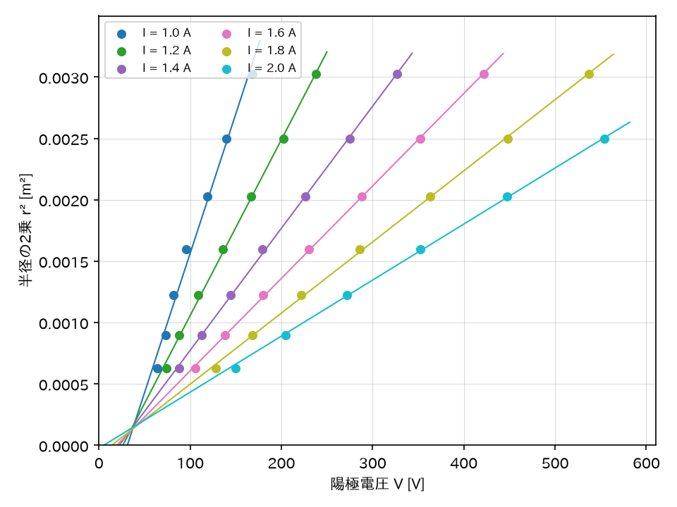
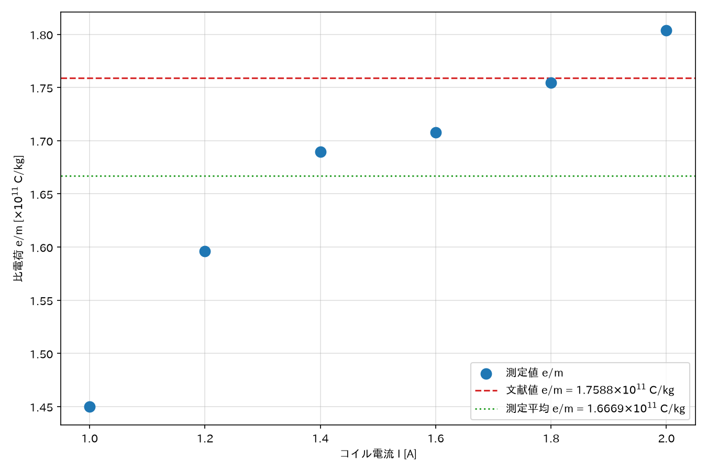

## 1. 目的

一様な磁界中で電子を円運動させ、そのときの電子の軌道半径・加速電圧・磁束密度の関係から、電子の比電荷（$e/m$）を実験的に求める。

## 2. 使用機器

- 電子の比電荷測定装置 EM-3N（ナリカ、型番B10-7352）
  - $e/m$管：ヘリウム封入、電子銃内蔵、円運動の直径を読み取るスケールを内蔵
  - $e/m$管用専用電源：ヒーター電源6.3V/0.4A、B電源0〜500V/30mA、コイル電源0〜15V/3A
  - ヘルムホルツ・コイル：巻数$N=130$回（片側）、半径$R=0.150$m
- 精密直流電流計：ヘルムホルツ・コイルに流す電流の測定用
- 磁針：地磁気などの外部磁界の向きを確認するため

## 3. 実験原理

### 3.1 電子の加速（電子銃）

陰極Kはヒーターにより加熱され熱電子を放出する。陰極に対して陽極Pに正の電圧$V$を加えると、その電界により電子が加速される。陰極から放出されたときの電子の速さを無視すると、エネルギー保存則より、陽極を通過した電子の速さ$v$は

$$
\frac{1}{2}mv^2=eV \tag{1}
$$

$$
v=\sqrt{\frac{2eV}{m}} \tag{2}
$$

と表される。

### 3.2 磁界中の電子の運動

一様な磁界中に、磁界に垂直に入射した電子は、磁界に垂直な平面上で等速円運動を行う。磁束密度を$B$、円運動の速さを$v$、円の半径を$r$とすると、ローレンツ力が円運動の向心力となることから

$$
evB=\frac{mv^2}{r}\quad\Longrightarrow\quad \frac{e}{m}=\frac{v}{rB} \tag{3}
$$

が成り立つ。式(2)と式(3)から速さ$v$を消去すると、電子の比電荷は次のように求められる。

$$
\frac{e}{m}=\frac{2V}{r^2B^2} \tag{4}
$$

### 3.3 ヘルムホルツ・コイルによる磁界

半径の等しい2つの円形コイルを、半径に等しい間隔で軸を共有するように並行に置き、同じ向きに同じ強さの電流$I$を流すと、コイル間に軸方向の一様な磁界ができる。ビオ・サバールの法則より、この磁界の強さ$H$は

$$
H=\frac{8}{5\sqrt{5}}\frac{I}{R}=0.7155\times\frac{I}{R}\ \text{[A/m]} \tag{5}
$$

で表され、巻数を$N$、真空の透磁率を$4\pi/10^{7}$とすると、コイル間の磁束密度$B$は

$$
B=0.7155\times\frac{4\pi}{10^{7}}\frac{NI}{R}=8.99\times10^{-7}\frac{NI}{R}\ \text{[Wb/m}^2\text{]} \tag{6}
$$

となる。本装置のコイルでは$N=130$、$R=0.150$mであるから、式(6)は

$$
B=7.79\times10^{-4}\times I\ \text{[Wb/m}^2\text{]} \tag{7}
$$

に帰着する。

### 3.4 最小二乗法による比電荷の算出

式(4)を変形すると、$r^2=\dfrac{2}{(e/m)B^2}V$となり、電圧$V$を横軸、$r^2$を縦軸にとれば、原点を通る直線関係が期待される。実際の測定では、電流$I$ごとに得られた$(V,\,r^2)$の組に対して最小二乗法により回帰直線

$$
r^2=KV+b \tag{8}
$$

を求め、その傾き$K$から

$$
\frac{e}{m}=\frac{2}{KB^2} \tag{9}
$$

として比電荷を算出する。ここで$B$は式(7)によりコイル電流$I$から求まる磁束密度である。

## 4. 実験手順

1. 磁針を用いてその場所の磁界の向きを調べ、ヘルムホルツ・コイルの面が磁針に平行になるように装置を設置し、コイルの軸方向に地磁気の成分がなるべく残らないようにした。
2. 陽極電源の電圧調整、コイル電源の電圧調整をいずれも最小にしてから、電源装置のスイッチを入れた。
3. 陰極が赤熱したことを確認し、$e/m$管内を見ながら陽極電圧を上げ、電子線の経路の発光が見え始めることを確認した。
4. ヘルムホルツ・コイルの電流$I$を1.0Aから2.0Aまで0.2A刻みの6段階に設定した。各電流値について、精密直流電流計でコイルの電流を確認しながら陽極電圧$V$を調整し、$e/m$管内蔵スケール上の直径$2r=5,6,7,8,9,10,11$cmの各目盛りに電子の描く円軌道が一致したときの陽極電圧$V$を読み取った。
5. 得られた電流$I$ごとの$(V,\,r^2)$の組について、最小二乗法により式(8)の回帰直線を求め、傾き$K$と切片$b$を算出した。あわせて式(7)からその電流$I$における磁束密度$B$を求め、式(9)により比電荷$e/m$を算出した。

## 5. 実験結果

### 5.1 測定値

各電流値における、直径$2r$（$=d$）、半径$r$、そのときの陽極電圧$V$の測定値を示す。

**表5.1　電流$I=1.0$Aにおける測定値**

| 直径$2r$ (cm) | 半径$r$ (m) | 電圧$V$ (V) |
|---:|---:|---:|
| 5 | 0.025 | 64 |
| 6 | 0.030 | 73 |
| 7 | 0.035 | 82 |
| 8 | 0.040 | 96 |
| 9 | 0.045 | 119 |
| 10 | 0.050 | 140 |
| 11 | 0.055 | 168 |

**表5.2　電流$I=1.2$Aにおける測定値**

| 直径$2r$ (cm) | 半径$r$ (m) | 電圧$V$ (V) |
|---:|---:|---:|
| 5 | 0.025 | 74 |
| 6 | 0.030 | 88 |
| 7 | 0.035 | 109 |
| 8 | 0.040 | 136 |
| 9 | 0.045 | 167 |
| 10 | 0.050 | 202 |
| 11 | 0.055 | 238 |

**表5.3　電流$I=1.4$Aにおける測定値**

| 直径$2r$ (cm) | 半径$r$ (m) | 電圧$V$ (V) |
|---:|---:|---:|
| 5 | 0.025 | 88 |
| 6 | 0.030 | 113 |
| 7 | 0.035 | 144 |
| 8 | 0.040 | 179 |
| 9 | 0.045 | 226 |
| 10 | 0.050 | 275 |
| 11 | 0.055 | 327 |

**表5.4　電流$I=1.6$Aにおける測定値**

| 直径$2r$ (cm) | 半径$r$ (m) | 電圧$V$ (V) |
|---:|---:|---:|
| 5 | 0.025 | 106 |
| 6 | 0.030 | 138 |
| 7 | 0.035 | 180 |
| 8 | 0.040 | 230 |
| 9 | 0.045 | 288 |
| 10 | 0.050 | 352 |
| 11 | 0.055 | 422 |

**表5.5　電流$I=1.8$Aにおける測定値**

| 直径$2r$ (cm) | 半径$r$ (m) | 電圧$V$ (V) |
|---:|---:|---:|
| 5 | 0.025 | 128 |
| 6 | 0.030 | 168 |
| 7 | 0.035 | 222 |
| 8 | 0.040 | 286 |
| 9 | 0.045 | 363 |
| 10 | 0.050 | 448 |
| 11 | 0.055 | 537 |

**表5.6　電流$I=2.0$Aにおける測定値**

| 直径$2r$ (cm) | 半径$r$ (m) | 電圧$V$ (V) |
|---:|---:|---:|
| 5 | 0.025 | 150 |
| 6 | 0.030 | 205 |
| 7 | 0.035 | 272 |
| 8 | 0.040 | 352 |
| 9 | 0.045 | 447 |
| 10 | 0.050 | 554 |
| 11 | 0.055 | 未測定 |

※電流$I=2.0$Aのとき、直径$2r=11$cm（$r=0.055$m）の電圧は未測定である（原因は6.2節で考察する）。

### 5.2 回帰直線と比電荷の算出結果

表5.1〜表5.6の各データに対し、式(8)による最小二乗法の回帰直線（傾き$K$、切片$b$）を求め、式(7)による磁束密度$B$とあわせて、式(9)から比電荷$e/m$を算出した結果を表5.7に示す。

**表5.7　電流ごとの回帰直線・磁束密度・比電荷**

| 電流$I$ (A) | 傾き$K$ (m²/V) | 切片$b$ (m²) | 磁束密度$B$ (Wb/m²) | 比電荷$e/m$ (C/kg) |
|---:|---:|---:|---:|---:|
| 1.0 | $2.271\times10^{-5}$ | $-7.072\times10^{-4}$ | $7.793\times10^{-4}$ | $1.450\times10^{11}$ |
| 1.2 | $1.433\times10^{-5}$ | $-3.754\times10^{-4}$ | $9.351\times10^{-4}$ | $1.596\times10^{11}$ |
| 1.4 | $9.946\times10^{-6}$ | $-2.210\times10^{-4}$ | $1.091\times10^{-3}$ | $1.689\times10^{11}$ |
| 1.6 | $7.533\times10^{-6}$ | $-1.467\times10^{-4}$ | $1.247\times10^{-3}$ | $1.708\times10^{11}$ |
| 1.8 | $5.794\times10^{-6}$ | $-8.121\times10^{-5}$ | $1.403\times10^{-3}$ | $1.754\times10^{11}$ |
| 2.0 | $4.565\times10^{-6}$ | $-2.340\times10^{-5}$ | $1.559\times10^{-3}$ | $1.804\times10^{11}$ |

6つの電流値から得られた$e/m$の平均は

$$
\left(\frac{e}{m}\right)_{平均}=1.667\times10^{11}\ \text{C/kg}
$$

である。

表5.1〜表5.6の$(V,\,r^2)$の関係と、表5.7の回帰直線を図1に示す。

**図1　電圧$V$と円運動半径の2乗$r^2$の関係（電流$I$ごと）**

また、コイル電流$I$と算出された比電荷$e/m$の関係を図2に示す。図中には、文献値および測定値6点の平均値もあわせて示す。

**図2　コイル電流$I$と比電荷$e/m$の関係**

## 6. 考察

### 6.1 比電荷の測定値について

表5.7および図2に示すように、測定された比電荷$e/m$はコイル電流$I$の増加とともに大きくなり、$1.450\times10^{11}\sim1.804\times10^{11}$C/kgの範囲に分布した。電子の比電荷の文献値は

$$
\left(\frac{e}{m}\right)_{文献}=1.7588\times10^{11}\ \text{C/kg}
$$

である[1]。6点の平均値$1.667\times10^{11}$C/kgと文献値を比較すると

$$
\frac{(e/m)_{平均}-(e/m)_{文献}}{(e/m)_{文献}}\times100\fallingdotseq-5.2\,\%
$$

となる。ただし、電流ごとの誤差を個別に見ると、$I=1.0$Aで$-17.5\,\%$、$I=1.2$Aで$-9.2\,\%$、$I=1.4$Aで$-3.9\,\%$、$I=1.6$Aで$-2.9\,\%$、$I=1.8$Aで$-0.3\,\%$、$I=2.0$Aで$+2.5\,\%$と、電流が大きくなるにつれて誤差の絶対値が単調に減少し、$I=1.8$A付近で文献値にほぼ一致している。

この傾向は、参考資料[1]に「ヘルムホルツ・コイルに流す電流が小さいと、この影響（地磁気などの影響）は大きくなります」と明記されている点と対応していると考えられる。すなわち、実験手順1で磁針を用いて地磁気の影響を抑える調整を行ったものの、完全には打ち消しきれなかった残留磁界がコイル電流$I$に依存せず一定の大きさで存在していたとすると、意図して発生させた磁束密度$B$（式(7)、$I$に比例）が小さい低電流域ほど、その残留磁界がBに対して相対的に大きな割合を占め、電子の軌道半径に無視できない誤差を生じさせたと推測される。電流を大きくするほどこの相対誤差が小さくなり、$e/m$が文献値に近づいたと考えられる。

また、地磁気などの残留磁界の影響に加えて、陽極電圧$V$の測定精度も誤差の傾向に寄与していると考えられる。電圧計自体の絶対的な読み取り精度はどの電流条件でもほぼ一定であるのに対し、実際に読み取った$V$の値は低電流域で$V=64$V、高電流域で$V=554$Vのように大きく異なっており、値そのものが小さい低電流域（低電圧域）ほど、同じ大きさの読み取り誤差が相対的に大きな割合を占めることになる。この点も、誤差の絶対値がコイル電流の増加とともに減少する傾向の一因になっていると考えられる。

また、表5.7の切片$b$はいずれの電流でも負の値となっている。式(8)の理想的な直線は原点を通る（$V=0$のとき$r^2=0$）はずであるが、実際の回帰直線は$V=64\sim554$Vの範囲のデータのみから求めたものであり、この範囲外である$V=0$付近まで直線を外挿したことによるずれが、負の切片として表れたものと考えられる。

なお、比電荷の算出自体は$I=1.4$A程度までの測定でも十分可能であったが、当日の実験には時間の余裕があったため、$I=2.0$Aまで測定範囲を拡張した。これは、上述のとおり地磁気などの残留磁界の相対的な影響がコイル電流の増加とともに小さくなると考えられることから、電流を大きくするほど$e/m$が文献値に単調に近づいていくと予想したためである。しかし表5.7・図2に示すとおり、実際には$I=1.8$A付近で文献値にほぼ一致した後、$I=2.0$Aでは誤差が$+2.5\,\%$へと符号を反転し、逆に文献値を上回る結果となった。残留磁界や電圧測定精度の影響のみを考えれば誤差は単調に0へ近づくはずであるが、実際にはこれらに加えて軌道半径や電圧の読み取りに伴う個々のばらつきも存在するため、電流ごとの誤差が完全に単調に変化するとは限らない。$I=2.0$Aでの符号反転は、こうした読み取りのばらつきが、電流増加に伴う残留磁界の影響の減少分を上回ったために生じたものと考えられる。

### 6.2 未測定点（$I=2.0$A、$2r=11$cm）について

表5.6に示したとおり、$I=2.0$Aのとき、$2r=11$cmに対応する電圧は未測定のまま記載している。これは、$2r=10$cmの時点で陽極電圧調整つまみがすでに可動範囲の限界に達しており、これ以上電圧を上げることができなかったため、$2r=11$cmに対応する電圧までは到達できず、測定不能であったことによる。なお、このときの電圧$V=554$Vは、参考資料[1]に記載された本装置の陽極電圧の最大定格（$500$V、陽極電流$10$mA）をすでに超えている。

### 6.3 $I=2.0$Aにおける符号反転の解釈について

6.1節では、$I=2.0$Aで誤差の符号が反転し文献値を上回った理由を、軌道半径や電圧の読み取りに伴う個々のばらつきが、電流増加に伴う残留磁界の影響の減少分を上回ったためと説明した。しかし、この結果についてはこれとは別の解釈も考えられるため、以下にあわせて示す。

図2に示すように、6点の測定値$e/m$は、$I=1.0$Aから$I=2.0$Aにかけておおむね単調に増加する傾向を示している。この単調増加の傾向自体が、コイル電流$I$の大きさによらず何らかの系統的な要因（例えば、残留磁界の影響の見積もり方や、回帰直線の外挿によるずれなど）によって生じているとすれば、$e/m$の測定値はもともとコイル電流$I$に対してほぼ単調に増加するという傾向を内在していた可能性がある。この見方に立てば、$I=2.0$Aで文献値をわずかに上回ったこと自体は特に異常な結果ではなく、6点全体を貫く単調増加の傾向線が、たまたま文献値付近を横切った結果に過ぎないとも解釈できる。

以上のように、$I=2.0$Aにおける符号反転については、(i)個々の測定のばらつきによる偶発的な結果とみる解釈と、(ii)$e/m$のコイル電流依存性そのものに系統的な単調増加傾向が存在し、文献値との一致・不一致は電流の大きさに応じて連続的に変化しているに過ぎないとみる解釈の、いずれの可能性も否定できない。本実験で得られた6点のデータのみからはどちらが支配的な要因であるかを判別することは難しく、今後より広い電流範囲での測定や、同一電流条件での反復測定を行うことで、両者を切り分けられると考えられる。

### 6.4 まとめ

本実験により、一様磁界中での電子の円運動から、電子の比電荷$e/m$を実験的に求めることができた。6つの電流条件で得られた$e/m$の平均値は文献値に対して$-5.2\,\%$の誤差であったが、電流を大きくするほど誤差はおおむね減少し（$I=2.0$Aでは読み取りのばらつきなどにより誤差の符号が反転し、文献値をわずかに上回る結果となったものの）、$I=1.8$A付近では文献値との差は$1\,\%$未満であった。これは、コイル電流が小さいほど地磁気などの外部磁界の相対的な影響を受けやすいという参考資料の記載と整合する結果であり、本実験の測定精度はコイル電流（すなわち磁束密度）をある程度大きく取ることで向上することが確認できた。

---

## 参考文献

[1] 株式会社ナリカ．「B10-7352　電子の比電荷測定装置 EM-3N　取扱説明書」．https://raw.githubusercontent.com/yanasota-creator/Reports/main/experiment-4-specific-charge/references/reference_materials.pdf　参照日:2026/7/8
