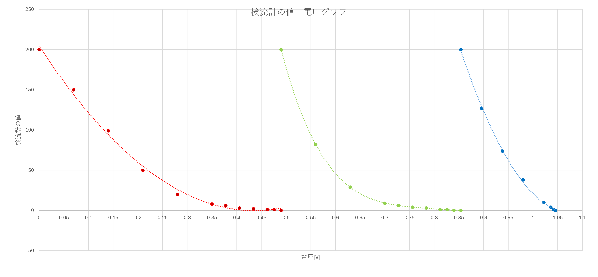
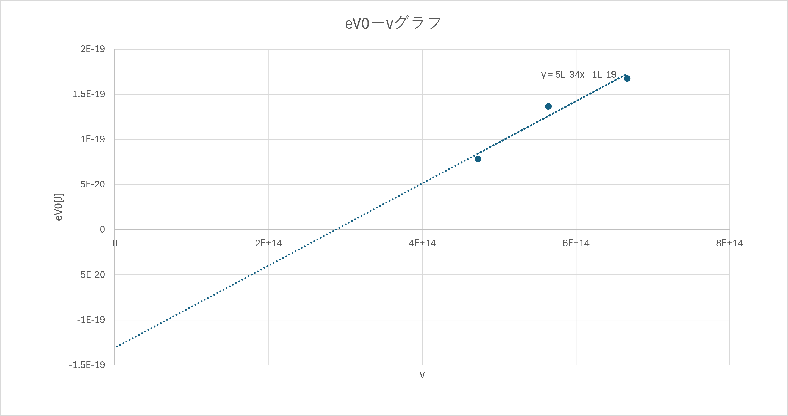

## 1. アブストラクト

光電管を用いて光電効果の実験を行い、赤色（$\lambda=635$nm）・緑色（$\lambda=532$nm）・青色（$\lambda=450$nm）の単色光について、光電流が0となる限界電圧$V_0$を測定した。振動数$\nu$と$eV_0$の関係を最小二乗法で直線回帰したところ、プランク定数$h_{実験}=4.546\times10^{-34}$J·sを得た。これは文献値$h=6.626\times10^{-34}$J·sに対して誤差31.4%と大きく乖離しており、光電面材料の仕事関数は$W=1.306\times10^{-19}$J（0.816eV）と求まった。誤差の主要因として、使用した測定点が3点のみと少ないこと、メートルブリッジによる電圧較正の系統誤差の可能性に加え、カーテン上部の隙間から漏れた外光が光電流に混入した可能性を考察した。

## 2. 目的

光電管を用いて光電効果の現象を学び、光電子の最大運動エネルギーと入射光の振動数の関係から、プランク定数$h$および光電面材料の仕事関数$W$を実験的に求める。

## 3. 使用機器

- 光電管（真空型）：光電面K・陽極Pを内蔵
- 光電管電圧装置：光電管にかける電圧を発生させる回路（メートルブリッジ・すべり抵抗・蓄電池を含む）
- 検流計（G）：光電流の大きさを目盛りで読み取る
- 電圧計（メートルブリッジのC端に接続、電圧較正用）
- 単色光源：赤色（$\lambda=635$nm）・緑色（$\lambda=532$nm）・青色（$\lambda=450$nm）の3色

## 4. 実験原理

金属または金属酸化物などの固体表面に振動数の高い光を当てると、その表面から電子（光電子）が飛び出す。この現象を光電効果と呼ぶ。この光電効果を応用した二極真空管が光電管であり、光の照射によって光電子を放出する光電面Kと、光電子を引きつける陽極Pとから成る。

アインシュタインの光量子仮説によれば、振動数$\nu$の光のエネルギーは$h\nu$（$h$：プランク定数）を単位とする光子として光電面内の電子に与えられる。光電面の内部から電子が飛び出すためにはエネルギー（仕事関数$W$）が必要であり、光子から余ったエネルギーが光電子の運動エネルギーとなる。電子の質量を$m$、飛び出す光電子の速さを$v$とすると

$$
\frac{1}{2}mv^2=h\nu-W \tag{1}
$$

が成り立つ。

いま、光電面Kが陽極Pに対して正極となるように電圧をかけ（逆極性）、その電圧を大きくしていくと、光電流は減少し、ある電圧で流れなくなる。光電流が0となるPK間の電圧（限界電圧）を$V_0$とすると、これは光電子の最大運動エネルギーを電界が押し戻す仕事と等しいという条件

$$
eV_0=\frac{1}{2}mv^2 \tag{2}
$$

を満たす（$e$：電子の電荷）。式(1)、式(2)より

$$
eV_0=h\nu-W \tag{3}
$$

が得られる。式(3)は$\nu$と$eV_0$が直線関係にあることを示しており、いくつかの異なる$\nu$（波長既知の単色光）に対してそれぞれ$V_0$を測定すれば、その直線の傾きからプランク定数$h$を、縦軸との切片から仕事関数$W$を決定できる。

## 5. 実験方法

1. 光電管、集束レンズ、光源をそれぞれ光学台上に配置し、光電管電圧装置の電圧測定端子・電流測定端子を接続した。
2. すべり抵抗を調節して、メートルブリッジ両端の電位差を適切な値にし、メートルブリッジのC端に接続した電圧計を用いて電圧較正を行った。これにより、メートルブリッジ上のBC間の距離から光電管にかけられる電圧を決定できるようにした。
3. 赤色（$\lambda=635$nm）の単色光を光電管に入射させ、メートルブリッジ上の接点Cを移動させて光電管にかかる電圧を0Vから徐々に増加させながら、そのつど検流計Gの目盛りから光電流の大きさを読み取った。
4. 光電流が0となる電圧（限界電圧$V_0$）を、検流計の目盛りが0になった位置から求めた。
5. 緑色（$\lambda=532$nm）、青色（$\lambda=450$nm）についても同様の測定を行い、それぞれの限界電圧$V_0$を求めた。
6. 各色の振動数$\nu=c/\lambda$（$c$：光速）と限界電圧から求めた$eV_0$との関係を最小二乗法で直線回帰し、その傾きからプランク定数$h$、切片から仕事関数$W$を求めた。

## 6. 実験結果

### 6.1 検流計の読み－電圧特性

赤・緑・青の各色について、メートルブリッジの位置（距離）から決定した電圧と、そのときの検流計の読みとの関係を測定した。測定データの一部を表1に示す（全データはdata/planck_constant.csvを参照）。

**表1　検流計の読み－電圧特性（抜粋、限界電圧$V_0$付近）**

| 色 | 電圧 [V] | 検流計の読み |
|:---:|---:|---:|
| 赤 | 0.406 | 3 |
| 赤 | 0.434 | 2 |
| 赤 | 0.462 | 1 |
| 赤 | 0.476 | 1 |
| 赤 | 0.490 | 0 |
| 緑 | 0.784 | 3 |
| 緑 | 0.812 | 1 |
| 緑 | 0.826 | 1 |
| 緑 | 0.840 | 0.2 |
| 緑 | 0.854 | 0 |
| 青 | 1.022 | 10 |
| 青 | 1.036 | 4 |
| 青 | 1.0416 | 1 |
| 青 | 1.0458 | 0 |

3色それぞれについて、電圧を横軸、検流計の読みを縦軸にとったグラフを図1に示す。いずれの色でも、電圧の増加とともに検流計の読みは単調に減少し、ある電圧でちょうど0になる。この0になる電圧を、各色の限界電圧$V_0$として読み取った。

**図1　検流計の読み－電圧グラフ（赤・緑・青）**

3色から得られた限界電圧$V_0$を表2に示す。

**表2　各色の限界電圧$V_0$と$eV_0$**

| 色 | 波長$\lambda$ [nm] | 振動数$\nu$ [Hz] | 限界電圧$V_0$ [V] | $eV_0$ [J] |
|:---:|---:|---:|---:|---:|
| 赤 | 635 | 4.72441×10¹⁴ | 0.490 | 7.840×10⁻²⁰ |
| 緑 | 532 | 5.63910×10¹⁴ | 0.854 | 1.3664×10⁻¹⁹ |
| 青 | 450 | 6.66667×10¹⁴ | 1.0458 | 1.67328×10⁻¹⁹ |

### 6.2 プランク定数と仕事関数の算出

表2の$\nu$と$eV_0$の関係を図2に示す。3点を最小二乗法で直線回帰すると

$$
eV_0=4.546\times10^{-34}\,\nu-1.306\times10^{-19}
$$

が得られた（回帰式の傾きが$h$、切片が$-W$に対応する）。

**図2　$eV_0$－$\nu$グラフと回帰直線**

この結果から、プランク定数と仕事関数は

$$
h_{実験}=4.546\times10^{-34}\ \text{J·s},\qquad W=1.306\times10^{-19}\ \text{J}=0.816\ \text{eV}
$$

と求まった。

## 7. 考察

### 7.1 文献値との比較

プランク定数の文献値[1]は$h=6.626\times10^{-34}$J·sである。本実験で得られた$h_{実験}=4.546\times10^{-34}$J·sとの誤差は

$$
\frac{4.546\times10^{-34}-6.626\times10^{-34}}{6.626\times10^{-34}}\times100\fallingdotseq-31.4\,\%
$$

であり、絶対値・符号の傾向（光電子のエネルギー効率が理論より低く見積もられている）を含めてかなり大きな系統的なずれが生じた。

### 7.2 誤差の要因についての考察

第一に、$\nu$－$eV_0$の直線回帰に用いた測定点が赤・緑・青の3点のみであったことが挙げられる。直線は2点で一意に定まるため、3点の回帰は実質的に自由度が乏しく、いずれか1色の$V_0$測定に生じた誤差が、傾き（プランク定数$h$）に直接大きく影響する。特に本実験では青色の$eV_0$が他の2色に比べて振動数の割に大きく、この1点のばらつきが傾きを大きく左右した可能性がある。

第二に、各色の限界電圧$V_0$は表1のように、検流計の読みが1目盛り程度から0になる境目の電圧として決定しており、検流計の感度限界（1目盛り未満の微小電流を読み取れないこと）により、真の$V_0$よりもわずかに高い電圧で0と判定してしまう可能性がある。ただし、この読み取り誤差は電圧にして数十mV程度であり（例えば赤色では0.476Vから0.490Vの間）、31\,\%という誤差の大きさを単独で説明するには小さい。

第三に、より大きな要因として、メートルブリッジによる電圧較正の系統誤差が考えられる。本実験では、光電管にかかる実際の電圧を直接読み取るのではなく、メートルブリッジ上の接点Cの位置（距離）から、あらかじめ較正した比率を用いて電圧に換算している。この換算比率（較正係数）が真の値から一定の割合でずれていた場合、全ての測定点の電圧（したがって$eV_0$）が同じ割合で系統的にずれることになる。式(3)より$h$は$eV_0$の$\nu$に対する傾きであるから、このような比例的な較正誤差は、そのままの割合で$h_{実験}$の誤差として現れる。実際、得られた$h_{実験}$の誤差率（$-31.4\,\%$）は、較正係数が真の値よりも約3割小さく見積もられていた場合の影響とほぼ一致する大きさであり、この電圧較正の不正確さが誤差の主要因であった可能性が高いと考えられる。なお、この種の較正誤差は全測定点に同じ比率で作用するため、切片（$-W$）にも影響するが、傾きほど支配的ではなく、実際に求まった仕事関数$W=0.816$eVは、光電面によく用いられるアルカリ金属系材料の仕事関数（おおむね1〜2eV程度）と大きくは外れないオーダーの値であった。

第四に、実験環境自体に起因する外光の混入も一因として考えられる。本実験では暗幕（カーテン）で外光を遮って測定を行ったが、同じ実験装置を用いた他の班でも$h=8.74\times10^{-34}$J·s（文献値に対し誤差$+31.9\,\%$）という、符号は逆であるものの本実験の$-31.4\,\%$とほぼ同程度の大きさの誤差が報告されている。測定手順や読み取りの手技が異なる別の班でも同程度に大きな誤差が生じていたことは、個々の測定操作によらない共通の要因、すなわちカーテン上部の隙間から漏れた外光が光電流に混入していた可能性を示唆している。混入した外光由来の電流が測定される光電流に重なることで、限界電圧$V_0$の読み取りに系統的なずれが生じ、結果としてプランク定数の見積もりに大きな誤差をもたらした可能性が高いと考えられる。

### 7.3 まとめ

赤・緑・青の3色の単色光を用いて光電効果の限界電圧を測定し、プランク定数$h_{実験}=4.546\times10^{-34}$J·s、仕事関数$W=0.816$eVを得た。$h_{実験}$は文献値に対して$-31.4\,\%$の大きな誤差を示したが、これは測定点数が3点と少なく回帰の自由度に乏しいことに加え、メートルブリッジによる電圧較正の系統誤差、およびカーテン上部の隙間から漏れた外光の混入（同一装置を用いた他の班でも$+31.9\,\%$という同程度の大きさの誤差が報告されている）が要因であった可能性が高い。今後の測定では、フィルタの数を増やして測定点を増やすこと、電圧較正をより高精度に行うこと、カーテンの隙間を塞いで外光の混入を防ぐことで、誤差の低減が期待できる。

## 参考文献

[1] CODATA. "CODATA Value: Planck constant". https://physics.nist.gov/cgi-bin/cuu/Value?h　参照日:2026/8/2

[2] 実験配布資料「実験29　光電管」．新物理学実験（pp.170-179）．
